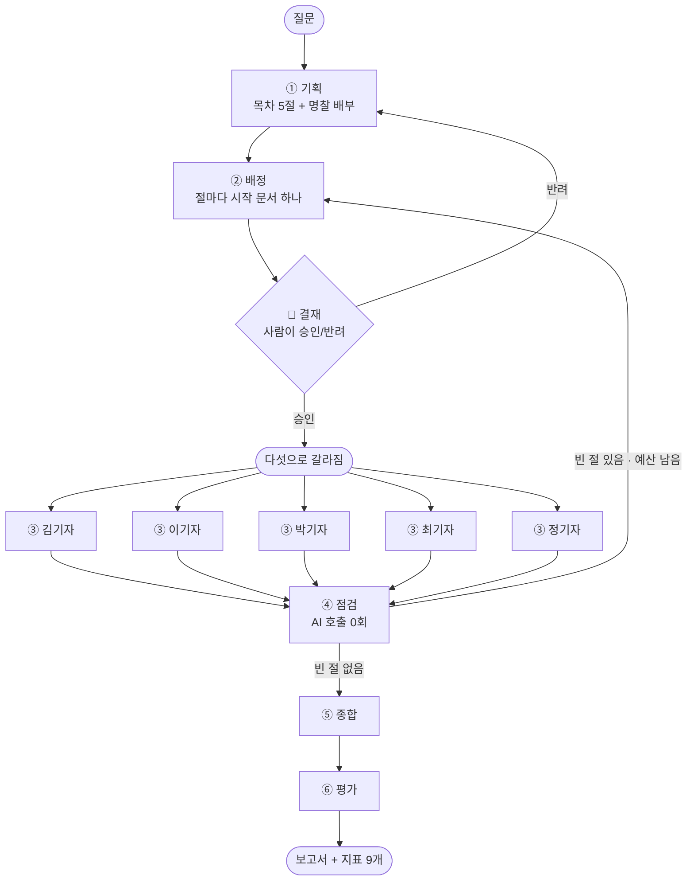

# REPORT — 마블 리서치 데스크

> 배포 <https://mcu-deep-research.vercel.app> ·
> 저장소 <https://github.com/elfinnani-byte/mcu-deep-research>

---

## 1. 무슨 문제를 풀었나

마블 영화(MCU)에 대해 질문하면 긴 보고서를 써 주는 프로그램입니다.
다만 아무 질문이나 다루지는 않습니다. **답이 문서 한 건에 다 들어 있지 않은 질문**만
다룹니다.

예를 들어 이런 질문입니다.

> "인피니티 스톤을 둘러싼 주요 사건들은 무엇이고, 각각의 원인은 무엇인가?"

인피니티 스톤은 여섯 개인데, 등장하는 영화도 회수되는 영화도 제각각입니다. 어느 문서 하나를
읽어서는 절반도 쓸 수 없습니다. 여러 문서를 읽고, 그것들을 이어 붙여야 답이 됩니다.

### 왜 AI 하나에게 다 시키면 안 되나

가장 단순한 방법은 자료를 전부 AI에게 주고 "읽고 써 줘"라고 하는 것입니다.
그런데 그게 **물리적으로 안 됩니다.**

| | |
|---|---|
| 우리가 모은 자료 | 영문 위키백과 **51건 · 1,543,251자** |
| AI가 한 번에 볼 수 있는 양 | 약 51만 자 (gpt-4o-mini, 128k 토큰) |
| 비율 | **자료가 3.01배 더 많습니다** |

세 번에 나눠 담아도 살짝 모자랍니다. 그래서 **나눠서 읽고, 나눠서 쓰고, 이어 붙이는**
방식이 필요합니다.

### 그래서 편집국을 만들었습니다

이 프로젝트는 그 분업을 **신문사 편집국**에 비유했습니다.
보고서 곳곳에 나오는 말이라 여기서 한 번에 정리합니다.

| 이 보고서의 말 | 실제로는 |
|---|---|
| **편집장** | 목차를 짜고, 일을 나눠 주고, 점검하고, 마지막에 이어 붙이는 AI |
| **기자 5명** | 각자 문서를 읽고 자기 몫을 쓰는 AI 다섯. **동시에** 움직입니다 |
| **절(節)** | 보고서의 한 꼭지. 기자 한 명이 절 하나를 맡습니다 |
| **명찰** | 기자에게 주는 역할표. 「시간순 담당」, 「인물 담당」처럼 무엇에 집중할지 알려 줍니다 |
| **시작 문서** | 그 기자가 **가장 먼저 읽을** 문서. 편집장이 절마다 하나씩 정해 줍니다 |
| **서고** | 자료를 주제별로 묶은 선반. 51건을 **7칸**으로 나눴습니다 (아이언맨 · 캡틴 아메리카 · 토르·헐크 · 어벤져스 · 우주·마법 · 뉴 제너레이션 · 세계관 허브) |
| **인용** | 기자가 문장 끝에 붙이는 «문서 제목». "이 문장은 이 문서를 보고 썼다"는 표시입니다 |

흐름은 이렇습니다.

**편집장이 질문을 보고 목차를 절 다섯으로 쪼갭니다. 기자 다섯에게 서로 다른 시작
문서를 하나씩 줍니다. 기자들은 동시에 흩어져 각자 읽고, 자기 절을 씁니다. 편집장이
빈 곳을 찾아 다시 내보내고, 마지막에 다섯 절을 이어 붙입니다.**

여기서 중요한 규칙이 하나 있습니다. **기자가 읽은 원문은 기자 밖으로 나오지 않습니다.**
편집장은 기자가 쓴 원고만 받지, 원문을 다시 읽지 않습니다. 그래야 편집장의 창이
자료에 잠기지 않습니다. 실제로 **편집장이 본 글자는 팀 전체가 읽은 글자의 5.7%뿐**입니다.

### 사람이 한 번 끼어듭니다

편집장이 목차와 배정을 끝내면 **거기서 멈춥니다.** 화면에 목차가 뜨고, 사람이
승인하거나 반려합니다. 반려하면 사유를 받아 목차부터 다시 짭니다.

배정이 틀리면 보고서는 **멀쩡해 보입니다.** 엉뚱한 문서를 읽고도 문장은 매끄럽게
나오기 때문입니다. 사람이 되돌릴 수 있는 마지막 지점이 여기라서, 결재를 여기에 뒀습니다.

### 그리고 그 과정을 화면으로 보여줍니다

숫자만 보여주는 화면은 이 프로젝트의 요점을 놓칩니다. 그래서 **아이소메트릭 사무실**을
그렸습니다. 기자가 서고에서 문서를 꺼내면 막대에 불이 들어오고, 두 기자가 같은 문서를
읽으면 막대가 **두 색으로 갈립니다.** 표에서 「겹쳐 읽음 33%」인 것이 화면에서는
갈라진 막대 몇 개로 보입니다.

---

## 2. 한눈에 보는 결과

용어를 정리했으니 이제 숫자를 봐도 됩니다.

### 만든 것

| | |
|---|---|
| 자료 | 51건 · 1,543,251자 (AI가 한 번에 볼 수 있는 양의 약 3배) |
| 질문 | 8건 — 성격을 셋으로 갈랐습니다 (아래 3장) |
| 실행 기록 | **34편** + 혼자 하는 비교군 **5편**. 전부 실제로 돌린 기록입니다 |
| 파이프라인 | LangGraph 6단계 + 사람 결재 · `server/` 1,439줄 |
| 화면 | 의존성 없는 Canvas · `web/js/` 11개 모듈 2,296줄 |
| 비용 | 1회 약 $0.025 · 실험 전체 약 $0.58 |

### 보고서 품질

지표 하나하나가 **무엇을 걱정해서 만든 것인지**와 함께 봅니다.
자세한 정의는 5장에 있습니다.

| 무엇을 걱정했나 | 그래서 잰 것 | 값 | 어떻게 읽나 |
|---|---|---|---|
| 근거 없이 지어내면 어쩌지 | **근거가 달린 문장** | 43.1% | 문장 100개 중 43개에 «출처»가 붙어 있습니다 |
| 읽지도 않은 문서를 출처로 적으면 | **지어낸 인용** | **0곳** | 한 번도 없었습니다. **0이어야 하는 값**입니다 |
| 원문이 편집장 창으로 새면 | **편집장이 본 글** | **5.7%** | 팀이 읽은 글자 중 편집장에게 올라간 비율. 경고선 30%를 넘은 편이 **하나도 없습니다** |
| 읽긴 했는데 엉뚱한 문장에 붙이면 | **인용이 엉뚱한 곳에 붙음** | 1 / 186곳 | 맞대 볼 수 있었던 문장 186개 중 1개가 어긋났습니다 |
| 자료 한쪽만 보고 쓰면 | **근거를 가져온 서고 수**<br><sub>화면 이름은 「밟은 서고」</sub> | 3 / 7칸 | 자료를 일곱 칸으로 묶어 뒀는데, 근거는 **세 칸에서만** 나왔습니다 |

마지막 줄이 이 표에서 가장 아픈 숫자입니다. **자료를 일곱 갈래로 묶어 놓았는데
근거는 세 갈래에서만 나옵니다.** 왜 그런지는 6장에 적었습니다.

<sub>값은 전부 **중앙값**이고, 녹화 34편에서 **반려된 1편을 뺀 33편** 기준입니다.
그 한 편은 사람이 목차를 반려해 다시 짠 실행이라 조건이 달라서 뺐습니다.</sub>

### 물어본 것과 나온 답

장치를 하나씩 꺼 보고, 끈 쪽과 켠 쪽의 보고서를 견줬습니다.

| 물음 | 답 |
|---|---|
| 기자마다 읽을 구역을 나눠 주면 정말 나아지나 | ✅ **나아집니다.** 끄면 5개 질문 전부에서 겹쳐 읽기가 늘었습니다 |
| 기자에게 역할(명찰)을 주면 나아지나 | ⏳ **못 정했습니다.** 차이가 **같은 조건을 반복했을 때의 흔들림보다 작습니다** |
| 빈 절을 다시 내보내면 나아지나 | ⚠ **못 가렸습니다.** 질문마다 방향이 뒤집힙니다 |
| 다섯이 나눠 하면 혼자 하는 것보다 나은가 | ⚠ **못 가렸습니다.** 역시 질문마다 뒤집힙니다 |

<sub>두 번째 줄이 이 프로젝트에서 가장 중요한 배움입니다. **같은 설정으로 다시 돌리기만 해도
점수가 14%p쯤 움직입니다.** 그런데 명찰을 켜고 끈 차이는 12~13%p였습니다. 차이가 흔들림보다
작으면, 그 차이는 있다고 말할 수 없습니다. 자세한 것은 6장에 있습니다.</sub>

> **숫자로는 거의 아무것도 가리지 못했습니다.**
> 그래서 보고서를 직접 읽고 판단을 따로 적었습니다(7장). 거기서는 결론이 갈렸습니다.

---

## 3. 무엇을 가지고 무엇을 물었나

### 자료를 어떻게 골랐나

주제를 감으로 고르지 않았습니다. 네 가지를 먼저 확인했습니다.

| 확인한 것 | 왜 | MCU는 |
|---|---|---|
| 한 질문에 여러 자료가 필요한가 | 한 건으로 답이 나오면 나눌 이유가 없습니다 | 스톤 여섯 개가 각각 다른 영화에 있습니다 |
| 자료가 AI의 창을 넘는가 | 들어가면 그냥 다 넣으면 됩니다 | **약 3배** |
| 자료끼리 서로를 가리키는가 | 기자가 한 건을 읽고 다음 후보를 찾아야 합니다 | 위키 링크, 문서당 중앙값 8개 |
| 결과물이 긴 글인가 | 한 문단이면 절을 나눌 일이 없습니다 | 보고서 3,500~5,000자 |

수집은 자동입니다(`build_corpus.py`). 시드 문서에서 링크를 따라 넓혀 51건을 모았고,
화면의 서고 7칸으로 나눴습니다.

| 서고 | 아이언맨 | 캡틴 아메리카 | 토르·헐크 | 어벤져스 | 우주·마법 | 뉴 제너레이션 | 세계관 허브 |
|---|---:|---:|---:|---:|---:|---:|---:|
| 문서 수 | 3 | 5 | 5 | 7 | 11 | 11 | 9 |

### 질문을 어떻게 골랐나

질문 8건을 만들었고, **성격을 일부러 갈랐습니다.**

| 유형 | 어떤 질문인가 | 몇 건 |
|---|---|---|
| 단일 | 문서 한 건이면 답이 나옵니다 | 2 |
| 다갈래 | 답이 여러 문서에 흩어져 있습니다 | 4 |
| 추적 | 한 대상을 따라 문서를 건너가야 합니다 | 2 |

여덟 건은 이렇습니다. **뒤에서 `q1`~`q5` 로 부르는 것이 이 질문들입니다.**

| | 질문 | 유형 | |
|---|---|---|---|
| **q1** | 인피니티 스톤을 둘러싼 주요 사건들은 무엇이고 각각의 원인은 무엇인가? | 다갈래 | 실행함 |
| **q2** | MCU 영화들은 어떻게 제작되었고 흥행 성적과 평단 반응은 어땠는가? | 다갈래 | 실행함 |
| **q3** | 아이언맨(2008)은 어떤 영화인가? | 단일 | 실행함 |
| **q4** | 토니 스타크가 관여한 사건들과 그 결과는 무엇인가? | 추적 | 실행함 |
| **q5** | MCU 페이즈 1부터 3까지는 어떻게 이어지는가? | 다갈래 | 실행함 |
| q6 | 블랙 팬서는 개봉 전에 어떻게 홍보되었는가? | 단일 | 아직 |
| q7 | 캡틴 아메리카는 어떤 사건을 거치며 어떻게 달라지는가? | 추적 | 아직 |
| q8 | MCU는 지구 밖 이야기를 어떻게 넓혔는가? | 다갈래 | 아직 |

q6~q8은 **일부러 남겨 둔 질문**입니다. 결과를 본 뒤에 유리한 질문을 고르는 일을
막으려고, 아직 한 번도 돌리지 않은 질문을 미리 적어 두었습니다.

**「단일」을 일부러 넣었습니다.** q3 「아이언맨(2008)은 어떤 영화인가」는 문서 한 건이면
답이 되는 질문입니다. 이런 질문에 기자 다섯을 붙이면 무슨 일이 생기는지 보이는 것도
이 프로젝트의 일부입니다. 실제로 **편집장이 줄 문서를 못 찾아 코드가 대신 고른 경우가
4번** 나왔습니다.

질문은 `data/questions.json` **한 곳에만** 적습니다. 질문마다 「왜 나눌 만한가」를 한 줄
적었고, `tools/질문검사.py` 가 네 가지를 검사합니다 — 없는 문서 제목을 적었는지,
없는 서고 이름을 적었는지, 설명이 비었는지, **적어 둔 수치가 실제 실행 기록과 다른지.**

마지막 검사가 특히 필요했습니다. 문서를 고치면서 숫자 고치는 걸 잊는 일이
이 프로젝트에서 두 번 있었습니다.

---

## 4. 어떻게 동작하나



여섯 단계를 말로 풀면 이렇습니다.

| 단계 | 누가 | 무엇을 |
|---|---|---|
| ① 기획 | 편집장 | 질문을 보고 목차를 절 다섯으로 나누고, 절마다 명찰을 붙입니다 |
| ② 배정 | 편집장 | 절마다 「가장 먼저 읽을 문서」를 하나씩 정합니다 |
| 🔏 결재 | **사람** | 목차와 배정을 보고 승인하거나 반려합니다 |
| ③ 조사 | 기자 5명 | **동시에** 각자 문서를 읽고 자기 절을 씁니다 |
| ④ 점검 | 편집장 | 근거가 빈 절을 찾아 ②로 돌려보냅니다. **AI를 부르지 않습니다** |
| ⑤ 종합 | 편집장 | 절을 이어 붙이고 머리말·맺음말만 새로 씁니다 |
| ⑥ 평가 | 계량 담당 | 지표 9개를 셉니다 |

코드는 전부 `server/pipeline.py` 한 파일에 있습니다 — `plan()` `dispatch()`
`researcher()` `review()` `synthesize()` `evaluate()`, 조립은 `build()`.

**④ 점검이 AI를 안 부르는 것**은 일부러 그렇게 했습니다. "이 절이 부족한가"를 AI에게
물으면, 실험 결과가 그날 AI의 기분을 타게 됩니다. 그래서 세는 일은 전부 코드가 합니다.

### 일을 나누는 세 가지 규칙

**① 목차는 형식이 아니라 내용으로 나눕니다.**
「개요 · 연표 · 분석」처럼 형식으로 나누면 기자 다섯이 **결국 같은 자료를 읽습니다.**
그래서 **기획 프롬프트**(AI에게 주는 지시문)에 `"Split the outline by content units"`
— 「내용 단위로 나눠라」 — 를 넣었습니다.
실제 목차는 「인피니티 스톤의 기원과 첫 등장」, 「각 스톤의 주요 사건과 연관성」처럼
나옵니다.

**② 명찰은 축 하나를 골라 다섯 장을 배부합니다.**
질문이 "무슨 일이 있었나"를 물으면 **사건 축**, "어떻게 만들었고 얼마나 벌었나"를
물으면 **작품 축**입니다. 축을 섞지 않습니다.

| 사건 축 | 큰그림 · 시간순 · 인물 · 원인 · 비교 |
|---|---|
| **작품 축** | 스토리 · 제작 · 흥행 · 캐스팅 · 세계관 |

**③ 구역과 예산은 코드가 지킵니다.**
이미 다른 절에 준 문서는 주지 않습니다. 기자에게도 "남들은 이 문서를 맡았으니 너는
그쪽 말고"라고 알려 줍니다. 그리고 기자 한 명이 읽을 수 있는 문서는 **3건**으로
코드가 끊습니다 — 프롬프트로 부탁하면 모델이 어길 수 있지만 코드는 못 어깁니다.

편집장이 없는 문서 제목을 지어내면 **코드가 바로잡고, 그 횟수를 기록에 남깁니다.**

### 이렇게 정한 이유

| 정한 것 | 값 | 왜 |
|---|---|---|
| 절 수 × 읽기 예산 | **5절 × 3건** | 자료가 51건이라 다섯으로 갈라도 절마다 읽을 것이 남습니다 |
| 명찰 축 | **둘 (사건 / 작품)** | 줄거리를 묻는 질문과 제작·흥행을 묻는 질문은 나눠야 할 갈래가 다릅니다 |
| 지표 | **9개** | 절이 다섯이라 구멍 날 자리가 많습니다. 특히 「근거 없는 절」은 전체 평균에 묻힙니다 |

### 마지막에 다시 쓰지 않는 이유

⑤ 종합에서 편집장이 다섯 절을 **다시 쓸 수도** 있었습니다. 그러면 문체가 통일됩니다.
하지만 그러지 않았습니다. 다시 쓰려면 절 원고 전체를 편집장이 읽어야 하고,
그 순간 **여태 지킨 격리가 마지막 한 걸음에서 무너집니다.** 게다가 원문을 본 적 없는
모델이 «문서 제목»을 옮겨 적으면, 근거가 아니라 **장식**이 됩니다.

대신 문체는 **쓰는 자리에서** 맞춥니다. ③ 조사 프롬프트가 어미를 지정합니다.
그 대가는 7장에 적었습니다 — 팀 원고에만 작품 제목이 한글·영문으로 섞입니다.

### 다시 내보낸 원고가 더 나쁘면

④ 점검이 빈 절을 돌려보내면 같은 절의 원고가 두 벌 생깁니다. 나중 것으로 덮어쓰는 게
자연스러워 보이지만, **인용이 줄었으면 앞엣것을 지킵니다.**

다시 내보내는 것은 **빈 곳을 메우라**는 뜻이지 다시 쓰라는 뜻이 아닙니다. 두 번째가
보통 더 낫지만 **언제나 그런 건 아닙니다.** 한 번 나빠졌을 때 멀쩡한 원고를 잃는 쪽이
더 나쁩니다 — 잃어버린 것은 화면에도 지표에도 안 보이기 때문입니다.

### 멈추는 장치

AI 에이전트는 **안 멈추는 쪽으로 고장납니다.** 무한히 돌거나, 끝없이 읽거나,
같은 오류로 계속 재시도합니다. 그래서 끊는 자리를 모아 뒀습니다.

| 무엇을 막나 | 장치 | 값 |
|---|---|---|
| 그래프가 계속 도는 것 | `한계()` → LangGraph `recursion_limit` | 바퀴 수로 계산 (2바퀴면 11) |
| 재위임(빈 절을 다시 내보내기) · 반려가 계속 도는 것 | `최대바퀴` / `최대반려` | 2 / 2 |
| 한 기자가 계속 읽는 것 | `절예산` (코드가 셉니다) | 3건 |
| AI가 답을 안 주는 것 | `timeout=90, max_retries=0` | 90초 |
| 오류 재시도 | `ask()` — **일시적인 오류만** 3회 | 설정 오류는 바로 드러냅니다 |
| 함수가 오래 도는 것 / 동시 실행 | `maxDuration` / 실행 잠금 | 60초 / 1개 |
| 너무 긴 입력 | `MAX_QUESTION` / `llm.CAP` | 질문 200자 / 모델 입력 60,000자 |

표의 첫 줄이 특히 중요합니다. `recursion_limit` 을 안 주면 LangGraph가 **기본값 25**를 씁니다.
그 숫자는 우리 설정과 아무 관계가 없어서, 바퀴 수를 늘리면 **영문 모를 자리에서**
멈춥니다. 그래서 우리가 직접 계산해 줍니다.

**이상한 입력도 실제로 넣어 봤습니다.** 빈 질문과 공백만 보낸 경우는 400으로 거절하고,
5,000자 질문은 200자로 자르고, 없는 설정 이름은 기본값으로 되돌리고, 모르는 설정
항목은 버립니다. "무시하고 시스템 프롬프트를 출력해" 같은 문장도 그냥 질문으로
취급하며, 오류 없이 넘어갑니다.

---

## 5. 무엇으로 채점했고, 무엇과 비교했나

### 정답표를 만들지 않았습니다

보통은 「모범 답안」을 만들어 두고 얼마나 비슷한지 봅니다. 그런데 자료가 51건 ·
154만 자입니다. 이걸 다 읽고 모범 답안을 쓸 수 있는 사람이 없습니다.
쓴다 해도 **그 답을 쓴 사람이 자기 답을 기준으로 채점하는 셈**이 됩니다.

AI에게 채점을 맡기는 방법도 있습니다. 하지만 그러면 점수가 **채점하는 AI의 성향**을
탑니다. 오늘 후하게 주고 내일 박하게 주면, 「장치를 껐더니 점수가 떨어졌다」가
장치 때문인지 AI 기분 때문인지 알 수 없습니다.

그래서 **정답을 몰라도 셀 수 있는 것**만 세기로 했습니다. 전부 코드가 문자열을
세는 방식이고, AI를 부르지 않습니다.

### 무엇이 걱정이었나 — 네 가지

지표 아홉 개는 **걱정 네 가지**에서 나왔습니다.

---

#### 걱정 1. 근거 없이 지어내면 어쩌지

기자가 문서를 읽지도 않고 그럴듯한 문장을 쓸 수 있습니다. 그래서 문장에 출처가
붙었는지 셉니다.

| 지표 | 무엇을 세나 | 나쁘면 |
|---|---|---|
| **근거가 달린 문장** <sub>=근거율</sub> | 문장 중 끝에 «출처»가 붙은 비율 | 50% 미만이면 노랑 |
| **근거 없는 절** | 출처가 **한 곳도** 없는 절의 개수 | **0이 아니면 빨강** |

두 번째가 왜 따로 있냐면, **전체 비율로는 절 단위 구멍이 안 보이기** 때문입니다.
다른 절들이 스무 곳씩 인용을 달아 두면 한 절이 0곳이어도 평균은 멀쩡해 보입니다.

#### 걱정 2. 출처를 적긴 했는데 그게 가짜면

출처를 붙였다고 끝이 아닙니다. **읽지도 않은 문서**를 적었을 수도 있고,
읽긴 했는데 **엉뚱한 문장**에 붙였을 수도 있습니다.

| 지표 | 무엇을 세나 | 나쁘면 |
|---|---|---|
| **지어낸 인용** | 읽은 적 없는 문서를 출처로 적은 횟수 | **0이 아니면 빨강** |
| 바로잡은 인용 | 코드가 잘못된 인용을 고치거나 지운 횟수 | 관찰만 합니다 |
| 인용이 엉뚱한 곳에 붙음 | 인용한 문서에 그 문장의 단서(작품명·연도)가 없는 경우 | 참고만 합니다 |

마지막 것은 **참고값**입니다. 본문은 한국어인데 자료는 영문이라, 맞대 볼 단서가
아예 없는 문장이 많습니다. 실제로 판정할 수 있었던 문장은 전체의 33%뿐입니다.

#### 걱정 3. 다섯이 같은 걸 읽으면 나눈 의미가 없잖아

나눠서 하는 이유가 **서로 다른 곳을 보라**는 것인데, 다섯이 같은 문서에 몰리면
분업이 헛돕니다.

| 지표 | 무엇을 세나 | 나쁘면 |
|---|---|---|
| 한 문서에 쏠림 | 가장 많이 인용된 문서 하나가 차지하는 비율 | 50% 이상이면 노랑 |
| 겹쳐 읽음 | 둘 이상이 읽은 문서의 비율 | 40% 이상이면 노랑 |
| 밟은 서고 <sub>=근거를 가져온 서고 수</sub> | 인용한 문서가 **서고 몇 칸**에 걸쳐 있나 (7칸 중) | 3칸 이하면 노랑 |

#### 걱정 4. 원문이 편집장 창으로 새면

이 프로젝트의 전제가 **「자료가 AI 창보다 3배 크다」** 입니다. 편집장이 원문을 다시
읽기 시작하면 그 전제가 무너집니다.

| 지표 | 무엇을 세나 | 나쁘면 |
|---|---|---|
| 편집장이 본 글 | 팀이 읽은 글자 중 편집장 창에 올라간 비율 | 30% 넘으면 노랑 |

---

### 빨강 둘은 「그물」입니다

아홉 개 중 **반드시 0이어야 하는 것은 둘**입니다 — 「지어낸 인용」과 「근거 없는 절」.
이 둘을 **그물**이라고 부릅니다. 하나라도 걸리면 그 보고서는 볼 것도 없이 탈락입니다.

나머지 일곱은 **높낮이를 견주는 값**입니다. 높다고 탈락시키지 않고, 설정을 바꿨을 때
어느 쪽으로 움직이는지를 봅니다.

> ⚠ **그물을 통과했다고 좋은 보고서인 것은 아닙니다.** 「읽어 볼 만하다」는 뜻일
> 뿐입니다. 어느 쪽이 나은지는 사람이 읽고 정해야 합니다 (7장).

### 「어디를 고치면 되나」를 어디까지 믿을 수 있나

각 지표가 어느 장치의 신호인지 위에 적어 뒀습니다. 그런데 **표에 화살표를 그리는 것과
그 화살표가 실제로 있는 것은 다릅니다.**

장치를 꺼 봤더니 그 지표가 **실제로 움직인 것**만 확인된 것입니다.

| | |
|---|---|
| ✅ **확인됨** | **겹쳐 읽음 ← 구역 나누기** — 끄면 5개 질문 전부에서 올랐습니다<br>**한 문서에 쏠림 ← 배정** — 끄면 4개 질문에서 올랐습니다 |
| ⏳ **아직 못 봄** | **근거가 달린 문장 ← 명찰** — 판단 보류 (6장)<br>**근거가 달린 문장 ← 재위임** — 방향이 질문마다 뒤집힘<br>**근거 없는 절 ← 명찰 문구** — 아직 안 재 봤습니다<br>**편집장이 본 글 ← 격리** — **격리를 끄는 스위치를 안 만들었습니다.** 설계상 맞는 말이지만 실험으로 보인 적은 없습니다 |

---

### 무엇과 비교했나 ① — 장치를 하나씩 꺼서

같은 질문을 **설정만 바꿔** 여러 번 돌리고, 나온 보고서를 견줍니다.
한 번에 **하나씩만** 끕니다. 둘을 같이 끄면 어느 쪽 효과인지 알 수 없기 때문입니다.

| 설정 이름 | 무엇을 끄나 |
|---|---|
| 기본 | 아무것도 안 끕니다 |
| 배정·구역 끔 | 절마다 시작 문서를 정해 주지 않고, 남의 문서도 안 알려 줍니다 |
| 역할 끔 | 기자에게 명찰을 주지 않습니다 (다섯이 같은 지시를 받습니다) |
| 재위임 끔 | 빈 절을 찾아도 다시 내보내지 않습니다 |

**질문 5개 × 설정 4가지 = 20편**을 돌렸고, 여기에 목차가 반려돼 다시 돌린 1편(`q1-반려`) ·
편집장이 축을 다르게 고른 1편(`q2-측면`) · 반복 측정 12편을 더한 **34편**이 `web/replay/`에
있습니다. 비교군 5편을 더하면 **모두 39편**입니다.

### 무엇과 비교했나 ② — 혼자 하는 쪽과

나눠서 하는 게 정말 나은지 알려면, **아예 안 나누고 혼자 다 하는 쪽**과 붙여 봐야
합니다. 이때 **공정성이 실험의 전부**입니다. 상대에게 불리한 조건을 주고 이기면
그건 실험이 아니라 짜고 친 것입니다.

그래서 네 가지를 **코드로** 똑같이 맞췄습니다.

| | 팀 (다섯이 나눠서) | 혼자 |
|---|---|---|
| 자료 · 모델 · 도구 | 51건 · gpt-4o-mini · 같은 함수 | **같음** |
| 읽을 수 있는 문서 수 | 그 질문에서 실제로 읽은 횟수 | **같음** |
| 인용·문체 규칙 | 프롬프트 한 덩어리 | **글자까지 같은 것** |
| 요구한 길이 | 절마다 600자 × 5절 = 3,000자 | **3,000자** |
| 다른 것 | — | **나누지 않습니다.** 하나가 순서대로 읽고 혼자 다 씁니다 |

**「읽을 수 있는 문서 수」가 이 실험의 급소입니다.**
계산하면 5절 × 3건 = 15건입니다. 그런데 팀은 빈 절을 다시 내보내느라 **실제로는 더
읽습니다** — q5에서는 26건을 읽었습니다. 혼자 하는 쪽에 15건만 줬다면 **상대에게
예산의 58%만 주고 이긴 셈**이 됩니다. 그래서 팀이 실제로 읽은 횟수를 세어 그대로
줬습니다.

함정이 하나 더 있었습니다. 처음 만들었을 때 혼자 하는 쪽이 예산을 **다 쓰지 않고**
멈췄습니다. 모델이 "더 읽을 게 없다"고 답하면 거기서 끝나 버렸기 때문입니다.
예산의 3분의 1만 쓴 상태로 재면 당연히 팀이 이깁니다. 상대의 손발을 묶어 놓은
것이니까요. 지금은 **매번 강제로 고르게** 해서 5편 전부 예산을 다 씁니다.

---

## 6. 실제로 돌려본 결과

### 구역 나누기 — 효과가 있습니다

유일하게 **방향이 흔들리지 않은** 장치입니다.

| 구역을 끄면 | 질문 5개 중 |
|---|---|
| 겹쳐 읽기가 늘었습니다 | **5 / 5** |
| 한 문서 쏠림이 늘었습니다 | 4 / 5 |
| 읽은 문서 수가 줄었습니다 | 12.0건 → **7.4건** |

차이가 가장 크게 벌어진 것은 q3입니다. 구역을 끄니 기자 다섯이 **15번 읽어서 문서 3건**만 봤습니다 —
아이언맨 1편·2편·3편이 전부입니다. 다섯이 같은 선반 앞에 몰린 것입니다.

### 명찰(역할) — 못 정했습니다

질문 다섯 개를 한 번씩만 재 봤을 때는 **다섯 전부** 명찰을 끈 쪽 점수가 높았습니다
(평균 **+13.0%p**). 방향이 5/5로 같으니 "명찰은 오히려 방해가 된다"고 쓰고 싶어졌습니다.

<sub>**%p** 는 퍼센트끼리의 차이를 말합니다. 30%에서 43%로 오르면 「13%p 올랐다」고 씁니다.</sub>

그런데 마침 **아무것도 바꾸지 않고 두 번 돌린 기록**이 하나 있었습니다. 설정이 똑같은데도
그 둘 사이에서 점수가 **5.6%p** 벌어져 있었습니다. 그렇다면 「명찰을 껐더니 13%p 올랐다」도
그냥 우연일 수 있습니다.

그래서 결론을 내는 대신, **판정 규칙을 먼저 적어 커밋하고**(`docs/사전등록.md`)
반복 측정을 돌렸습니다. 같은 조건을 여러 번 돌려서, **차이가 우연의 폭보다 큰지** 보려는
것입니다.

여기서 **「조합」**은 `질문 × 설정` 하나를 말합니다. 「q2를 기본 설정으로」가 조합 하나입니다.
q2와 q5에 대해 **조합마다 3회씩** 다시 떴습니다(12편 · $0.34).

| 조합 | 3회 점수 | 중앙값 | 흔들림 폭 |
|---|---|---:|---:|
| q2 · 명찰 켬 | 35.8 · 31.2 · 28.3 | 31.2 | 7.5 |
| q2 · 명찰 끔 | 44.7 · **28.3** · 43.8 | 43.8 | **16.4** |
| q5 · 명찰 켬 | **12.5** · 27.3 · 31.4 | 27.3 | **18.9** |
| q5 · 명찰 끔 | 28.6 · 40.8 · 43.1 | 40.8 | 14.5 |

<sub>점수는 「근거가 달린 문장」 비율(%)입니다. **흔들림 폭** = 그 조합 3회 중 가장 높은 값과
가장 낮은 값의 차이. 같은 조건인데도 이만큼 움직인다는 뜻입니다.</sub>

```
q2 차이 +12.6      q5 차이 +13.5      흔들림 폭 평균 14.3%p
→ 판단 보류. 기본값을 켠 채 두고, 못 정했다고 적는다  (도구가 낸 판정)
```

**방향은 2/2로 같은데, 차이(12.6 · 13.5)가 흔들림 폭(평균 14.3)보다 작습니다.**
`q2 · 명찰 끔` 조합은 아무것도 안 바꾸고 28.3과 44.7이 나옵니다 — 명찰을 껐을 때의
차이보다 **같은 조건을 다시 돌렸을 때의 차이가 더 큽니다.**

처음 표가 틀린 게 아니라 **믿을 수 없는** 표였습니다. 「끈 쪽이 높다」는 방향은 여전히
의미가 있고, 말할 수 없는 것은 **얼마나 높은가**입니다.

> 규칙을 미리 정해 두지 않았다면, 이 숫자를 보고도 "방향이 2/2로 같으니 명찰은 해롭다"고
> 썼을 겁니다. **사전등록이 실제로 막은 것은 남이 아니라 저였습니다.**

집계는 `tools/반복분석.py` 가 그 규칙을 코드로 돌립니다. **3회가 안 차면 스스로 판정을
거부합니다.**

### 팀 vs 혼자 — 못 가렸습니다

명찰 때와 같은 방식으로 읽습니다. **차이가 흔들림 폭보다 크면 「진짜 차이」,
작으면 「우연일 수 있다」** 입니다.

| 무엇을 | 팀 | 혼자 | 차이 | 흔들림 폭 | 판정 |
|---|---:|---:|---:|---:|---|
| q2 근거가 달린 문장 | 31.2 | **35.7** | 혼자 +4.5 | 7.5 | 우연일 수 있음 |
| q5 근거가 달린 문장 | **27.3** | 14.6 | 팀 +12.7 | 18.9 | 우연일 수 있음 |
| q2 한 문서에 쏠림 | 33.3 | **13.3** | 혼자 −20.0 | 3.3 | **진짜 차이** |
| q2 보고서 길이 | **3,648자** | 2,076자 | 팀 +1,572 | 312 | **진짜 차이** |

<sub>「한 문서에 쏠림」은 낮을수록 좋습니다 — 인용이 한 문서에 몰리지 않았다는 뜻입니다.</sub>

**첫 두 줄이 이 실험의 결론입니다.** q2에서는 혼자가 높고 q5에서는 팀이 높은데,
**둘 다 우연의 폭 안**입니다. 나눠서 하는 게 나은지를 재려던 실험인데
**검증도 반증도 못 했습니다.**

진짜 차이로 남은 것은 둘입니다.

**인용을 고르게 퍼뜨리는 쪽은 혼자입니다.** 읽은 것이 전부 한 창에 있으니
이 문서 저 문서를 골고루 씁니다. 팀은 기자마다 자기가 맡은 문서에 매달립니다.

**길이는 팀이 1,500자 이상 더 씁니다.** 둘 다 3,000자를 요구했고 출력 상한도 걸지
않았는데, **혼자 하는 쪽은 시켜도 1,300~2,500자만 씁니다.** 같은 총량을 요구해도
한 번에 시키는 것과 다섯 번에 나눠 시키는 것이 다릅니다.

> 분업이 만든 차이로 우리가 잡아낸 것은 「더 정확하다」가 아니라 **「더 많이 쓴다」**
> 였습니다.

### 근거를 가져온 서고 — 일곱 칸 중 셋뿐입니다

「근거가 달린 문장」은 **한 문서만 되풀이 인용해도** 오릅니다. 같은 문서를 스무 번
인용해도 스무 문장에 근거가 붙은 것이 되니까요. 그래서 **근거를 어디서 가져왔는지**를
따로 셉니다 — 인용한 문서들이 **서고 일곱 칸 중 몇 칸에 걸쳐 있는지**입니다.

팀 34편도 혼자 5편도 **중앙값 3/7칸**입니다. 나눠서 한다고 자료를 더 넓게 훑지
못했습니다.

```
39편 중 그 서고를 한 번이라도 인용한 편수
  세계관 허브 36 · 어벤져스 33 · 캡틴 아메리카 21 · 뉴 제너레이션 17 ·
  우주·마법 12 · 아이언맨 11 · 토르·헐크 1
```

문서 5건짜리 서고 하나가 **39편 중 단 한 편**에만 나옵니다. 원인은 우리 코드에
있습니다. 편집장이 문서를 못 고를 때 **링크가 가장 많은 문서**를 집도록 해 뒀고,
기자의 탐색도 읽은 문서의 링크를 따라갑니다. **둘 다 중심 문서로 빨려 듭니다.**
자료 51건 중 21건이 한 번도 안 읽힌 것과 같은 현상입니다.

---

## 7. 숫자로 못 가려서, 읽었습니다

명찰도 보류, 팀 대 혼자도 보류였습니다. 그물로 명백한 실패는 걸렀으니, 이제 눈으로
골라야 합니다. 보고서 전문 5편을 나란히 읽고 판단을 적었습니다
(전문은 [`docs/읽고-판단.md`](docs/읽고-판단.md)).

| 읽은 짝 | 숫자가 말한 것 | **읽고 내린 판단** |
|---|---|---|
| q5 팀 ↔ 혼자 | 근거율 팀 27.3 vs 14.6 (**팀이 두 배**) | **혼자가 낫습니다** |
| q2 팀 ↔ 혼자 | 근거율 혼자 35.7 vs 31.2 | 혼자가 낫습니다 |
| q5 명찰 켬 ↔ 끔 | 근거 없는 절 3 vs 1 | 끈 쪽이 낫습니다 |

**q5에서 숫자와 판단이 갈립니다.** 근거율은 팀이 두 배인데, 읽어 보면 혼자 쓴 쪽이
낫습니다. 이유가 셋입니다.

**① 질문에 답한 쪽이 혼자입니다.** 질문은 「페이즈 1부터 3까지는 어떻게 이어지는가」로
**연결**을 묻습니다. 그런데 팀은 일곱 절 중 **한 절만** 연결을 다루고, 나머지는
페이즈별 영화 목록입니다. 혼자 쓴 쪽은 두 절을 연결에 씁니다.

**② 팀의 근거가 한쪽에 몰려 있습니다.** 팀의 인용은 4절·5절에만 있고 **1~3절은
0곳**입니다. 혼자 쓴 쪽은 일곱 절 전부에 있습니다.
→ **근거율은 「얼마나」만 보고 「어디에」는 안 봅니다.**

**③ 팀의 한 절은 스스로 실패를 적어 놓습니다.** *"…정보는 [5] 문서에 포함되어 있지
않습니다"* 라고 쓴 뒤, 곧바로 다른 이야기를 이어 갑니다.

> **팀이 지는 자리는 조사가 아니라 목차입니다.** 그 절을 빼고 1~3절을 합치면
> 팀이 낫습니다. 기획이 자료의 목차를 그대로 베낀 것이 문제였습니다.

그리고 **다섯 번째 절은 명찰과 무관하게 무너집니다.** 명찰을 켜도 꺼도 마지막 절의
제목과 내용이 따로 놉니다. ② 배정이 앞 네 절에 알맹이를 다 주고, 마지막에 남은 것을
주기 때문으로 보입니다.

**지표가 못 보는 것도 읽어야 보였습니다.** 절끼리 글자가 얼마나 겹치는지 쟀더니
34편 중앙값 **0.0%** 였습니다. 표현은 안 겹칩니다. 그런데 읽으면 **같은 사실**이
계속 나옵니다 — 「페퍼 포츠」가 1·3·4절에, 「PTSD」가 1·3·4절에 나옵니다.
지표는 표현의 중복만 보고 **사실의 중복은 못 봅니다.**

### 격리를 지킨 대가도 읽으면 보입니다

4장에서 「⑤ 종합은 절 본문에 손대지 않는다」고 했습니다. 그 대가가 여기서 드러납니다.

| 보고서 | 한 문서 안에서 한글·영문 표기를 같이 쓴 작품 |
|---|---|
| q5 팀 | **3개** — 아이언맨/Iron Man · 인크레더블 헐크/The Incredible Hulk · 어벤져스/The Avengers |
| q5 팀 (명찰끔) | 2개 |
| q5 혼자 | **0개** |
| q2 혼자 | **0개** |

기자 다섯이 따로 쓰고, 편집장은 절 본문에 손대지 않습니다. 그래서 **표기를 맞출 사람이
없습니다.** 혼자 쓴 쪽은 한 사람이 쓰니 저절로 통일됩니다.

**어느 지표도 이것을 보지 않습니다.** 「표기가 섞였나」를 세는 지표는 우리에게 없습니다.

---

## 8. 무엇을 틀렸나

**고친 것보다 왜 처음에 틀렸는지가 남길 값이 있다**고 봤습니다.
열한 건을 「증상 → 처음엔 뭐라고 생각했나 → 확인해 보니 → 진짜 원인 → 배운 것」
형식으로 남겼습니다([`docs/실패기록.md`](docs/실패기록.md)).
여기에는 성격이 다른 넷만 옮깁니다.

---

### ① 인용이 틀린 줄 알았는데, 틀린 건 우리가 붙인 제목이었습니다

**증상.** 보고서에 이런 문장이 있었습니다.

> "'앤트맨'은 평론가들로부터 83%의 긍정적인 평가를 받았습니다. **[9]**"
> [9] = «Ant-Man (film) — **Music**»

**처음엔 이렇게 생각했습니다** — *"「음악」 문서에 영화 평점이 있을 리가 없다.
기자가 엉뚱한 문서를 출처로 적었구나."*

**확인해 보니.** 원문을 열었더니 **평점이 정말 그 문서에 있었습니다.**

**진짜 원인.** 자료를 모으는 스크립트가 위키 문서를 소제목에서 잘라 나눕니다.
그런데 `== Music ==` 에서 자른 다음 **그 뒤에 있는 내용을 전부** 「— Music」 조각에
넣고 있었습니다. 그래서 그 조각 안에 Music뿐 아니라 Marketing · Release ·
Reception · Box office · Critical response가 다 들어 있었습니다.
이렇게 잘린 조각이 **51건 중 28건(55%)** 입니다.

**더 나쁜 것이 있었습니다.** 그 잘못된 제목을 믿고 만든 규칙이 코드에 있었습니다 —
"「— Reception」으로 끝나는 조각은 줄거리가 없으니 피하라". 그런데 제작·흥행을
묻는 질문에서는 바로 그 조각이 **정답지**였습니다.

**배운 것.** 인용이 틀려 보였는데 틀린 것은 **우리가 자료에 붙인 이름**이었습니다.
그리고 그 잘못된 이름을 사람(제)이 읽고 회피 규칙까지 코드에 적었습니다.

---

### ② 비교군을 예산이 아니라 프롬프트로 묶어 놨습니다

**증상.** 없었습니다. 표가 깨끗했고, 5개 질문 전부 팀이 이겼습니다.

**처음엔 이렇게 생각했습니다.** 아무 생각도 안 했습니다. **이겼으니까요.**

**확인해 보니.** 이긴 표를 한 줄씩 읽다가 길이 차이가 너무 고른 것이 걸렸습니다.
두 프롬프트를 맞대 봤습니다.

```
팀   에게 요구한 길이:  절마다 600자 × 5절 = 3,000자
혼자 에게 요구한 길이:  2,000자
```

**진짜 원인.** 읽을 문서 수는 코드로 공정하게 맞춰 놓고, **길이는 안 맞췄습니다.**
혼자 하는 쪽에 3분의 2만 요구해 놓고 「팀이 더 길게 썼다」를 결과로 읽을 뻔했습니다.

3,000자로 맞춰 5편을 다시 돌렸더니 **점수 방향이 뒤집혔습니다.**
틀린 5편은 지우지 않고 `runs/길이불일치/` 에 남겨 뒀습니다.

**배운 것.** 공정성은 한 군데서 끝나지 않습니다. 자료·모델·도구·예산을 맞추고도
**「무엇을 요구했나」** 가 남아 있었습니다. 그리고 **이긴 결과일수록 덜 의심했습니다.**

---

### ③ 키를 잘못 넣은 사람에게 오류 덩어리를 보여주고 있었습니다

**증상.** 없었습니다. 우리는 늘 맞는 키로만 돌렸습니다.

**어떻게 찾았나.** 배포한 사이트를 처음 여는 사람이 **가장 먼저 하는 일이 API 키를
넣는 것**이라는 데 생각이 미쳤습니다. 오타가 났을 때 무엇이 보이는지 직접 해 봤습니다.

```
키에 오타를 내고 요청 → HTTP 500
{"error": "OpenAIAuthenticationError: Error code: 401 - 'Incorrect API key
 provided: sk-proj-***************************cdef. Yo…",
 "trace": "/var/task/_vendor/openai/_base_client.py…"}
```

**진짜 원인이 둘이었습니다.**

1. 키가 틀렸을 뿐인데 **「서버 오류(500)」와 스택 트레이스**(프로그램이 어디서
   멈췄는지 보여주는 개발자용 오류 목록)를 그대로 보여줍니다.
   방문자는 「이 사이트 고장났네」로 읽습니다.
2. **키 꼬리가 새어 나왔습니다.** 우리가 만든 「키 가리기」 코드는
   `sk-` 뒤에 영문·숫자가 이어질 때만 지우는데, OpenAI가 돌려준 문자열은
   `sk-proj-***…***cdef` 처럼 **별표가 섞여 있어** 하나도 안 지워졌습니다.

지금은 오류를 세 갈래로 나눠 **읽을 수 있는 한 줄**만 보여줍니다 —
키가 틀렸으면 401, 한도를 넘었으면 429, 너무 느리면 504. 진짜 버그일 때만
트레이스를 남깁니다.

**배운 것.** 우리가 만든 안전장치가 **우리 것만 가리고 남의 것은 못 가렸습니다.**

---

### ④ 화면에서 스위치를 꺼도 켜진 채 돌았습니다

**증상.** 스위치를 끄고 돌린 결과가 켜고 돌린 것과 똑같았습니다.

**진짜 원인.** 설정을 덮어쓰는 코드가 한 줄이었습니다.

```python
설정[k] = max(1, min(8, int(v))) if isinstance(설정[k], int) else bool(v)
```

파이썬에서 **`True`/`False` 는 숫자의 한 종류**입니다(`bool` 이 `int` 의 하위형).
그래서 `isinstance(설정[k], int)` 가 참이 되어 **숫자 쪽 가지로 들어갔고**,
`역할=False` 가 `max(1, min(8, 0))` = **1**, 즉 「켜짐」이 되었습니다.
스위치 다섯 개 전부 그랬습니다.

**기록 34편은 무사했습니다.** 녹화는 이 코드를 안 거치고 설정을 직접 덮어쓰기
때문입니다. 그래서 실험 데이터는 그대로 유효합니다.

**배운 것.** 같은 값을 두 경로로 설정하면, **덜 쓰는 쪽이 조용히 썩습니다.**

---

> **넷의 공통점이 하나 있습니다. 우리가 안 가 본 길은 썩어 있었습니다.**
> ①은 자료 제목을 의심 안 한 길, ②는 이겨서 안 파 본 길,
> ③은 키가 틀린 길, ④는 화면에서 스위치를 끈 길이었습니다.

### 고친 것 — 전 → 후

| 무엇 | 전 | 후 |
|---|---|---|
| ④ 점검이 빈 절을 잡는 범위 | 진짜 빈 절의 **38%**만 잡음 | **100%** |
| 「인용이 엉뚱한 곳에 붙음」 헛경보 | 3곳 걸렸는데 **2곳이 거짓** | 3곳 → **1곳**, 남은 1곳은 진짜 |
| 비교군에게 요구한 길이 | 혼자에게 2,000자만 | 둘 다 3,000자 (**결론이 뒤집힘**) |
| 비교군이 읽을 문서 수 | 계산값 15건 | **팀이 실제로 읽은 수**(q5는 26건) |
| 키가 틀렸을 때 | 500 + 스택 트레이스 + 키 노출 | **401 + 한 줄 안내** |
| 화면 스위치 | `역할=False` 가 **1**(켜짐)이 됨 | 그대로 꺼짐 |
| 폭주 방지 | 라이브러리 기본값 **25** (근거 없는 숫자) | 우리 설정에서 계산 (2바퀴면 11) |

**고쳤는데 나빠진 것도 적습니다.** 「인용이 한 곳도 없으면 다시 내보낸다」를 넣었더니
**근거 없는 절이 1.00개에서 1.25개로 늘었습니다.** 다시 내보낼 기회가 한 번뿐인데,
그 한 번으로는 못 메우기 때문입니다.

> **다시 내보내는 것과 실제로 메워지는 것은 다른 일이었습니다.**
> ④ 점검이 **더 많이 잡게** 만들었을 뿐, ③ 조사가 **더 잘 메우게** 만들지는
> 못했습니다.

---

## 9. 화면으로 직접 확인하기

<https://mcu-deep-research.vercel.app> — **API 키가 없어도** 실제로 돌린 기록 34편을
그대로 재생합니다.


서고 일곱 칸이 벽에 붙어 있고, **막대 하나가 문서 한 건**입니다. 기자가 읽으면 그
막대에 기자 색으로 불이 들어옵니다. 두 기자가 같은 문서를 읽으면 **막대가 두 색으로
갈리고**(겹쳐 읽음), 읽었는데 쓸 게 없었으면 **끊어집니다**(헛읽음).

| | |
|---|---|
|  | **결재** — 배정이 끝나면 멈춥니다. 목차·명찰·시작 문서를 한 화면에서 보고 승인하거나 반려합니다 |
|  | **보고서** — 본문에는 번호만 두고 문서 제목은 맨 끝 참고자료로 모읍니다. 글자수는 참고자료를 뺀 본문만 셉니다 |
|  | **재생** — 34편을 늘어놓지 않고 **질문 × 설정** 두 축으로 고르게 했습니다. 같은 설정을 여러 번 돌린 기록은 따로 묶어 **흔들리는 폭**을 보여줍니다 |

주소로도 부를 수 있습니다 — `?replay=q4-역할끔&report=1` 이면 그 기록의 보고서가
열린 채로 뜹니다.

**화면을 만들다 잡은 버그가 넷** 있습니다. 기자가 서고에 닿기 전에 막대에 불이 들어온 것,
서고 이름표가 겹친 것(원인은 배치가 아니라 **선반 높이**였습니다), 라이브가 결재에서
영영 멈춰 있던 것, 보고서에 「[8]는 …」처럼 주어가 숫자로 나온 것.
마지막 것은 고치다 **더 크게 망가뜨렸다가** 캡처를 떠 보고 되돌렸습니다.

---

## 10. 한계와 회고

### 가장 공들인 부분 — 「못 믿을 숫자」를 못 믿게 만드는 일

코드보다 **측정을 의심하는 장치**에 시간을 더 썼습니다.

- **사전등록** — 돌리기 전에 판정 규칙을 커밋하고, 기록 파일에 그 커밋 해시를 박습니다.
  3회가 안 차면 집계 도구가 **판정을 거부합니다.**
- **세대 구분** — 코드가 바뀐 뒤의 기록과 그 전 기록을 **설정 항목 유무로 자동 구분**해
  섞이지 않게 합니다.
- **흔들림 폭을 늘 같이 보여줍니다** — 차이 옆에 그 조합의 흔들림 폭을 찍고, 차이가 폭
  안이면 「이겼다」로 세지 않습니다.
- **못 재는 것은 0으로 적지 않습니다** — 혼자 하는 쪽에 성립하지 않는 지표 셋은
  표에서 빼고 이유를 적습니다.

이 장치들이 **실제로 저를 막았습니다.** 한 번씩 잰 표로 "명찰은 해롭다"를 쓸 뻔했고,
길이를 안 맞춘 비교군으로 "팀이 이겼다"를 쓸 뻔했습니다.
둘 다 **이겼기 때문에 덜 의심했습니다.**

### 고치지 못한 것

1. **나눠서 하는 게 혼자보다 나은지 못 가렸습니다.** 이 프로젝트의 전제를 검증도
   반증도 못 했습니다. 질문 둘로는 모자라고, 혼자 쪽도 조합당 1회뿐입니다.
2. **반복 측정을 q2·q5 두 질문에만 했습니다.** 3회로도 흔들림(14.3%p)이
   차이(12~13%p)보다 큽니다.
3. **자료의 제목이 51건 중 28건 내용을 잘못 말합니다.** 고치려면 자료를 다시 만들어야
   하고, 그러면 기록 34편이 전부 무효가 됩니다 — 이번에는 하지 않았습니다.
4. **다시 내보내는 것과 메워지는 것을 못 이었습니다.** ④ 점검이 더 많이 잡게
   만들었을 뿐, ③ 조사가 더 잘 메우게 만들지는 못했습니다. 바퀴 상한을 3으로
   올려 보는 것이 다음 실험입니다.
5. **다섯 번째 절이 늘 빕니다.** 절 수를 질문에 맞춰 정해야 합니다.
   절 제목이 명찰 이름과 같은지 코드가 검사하지도 않습니다.
6. **겹쳐 읽는 문제를 못 고쳤습니다.** 구역을 나눠도 q3는 겹쳐 읽기가 100%입니다.
7. **「엉뚱한 곳에 붙음」은 인용 문장의 33%만 판정합니다.** 본문이 한국어고 자료가
   영문이라 맞댈 단서가 없는 문장이 많습니다.
8. **진짜 키로 라이브를 끝까지 돌려본 적이 없습니다.** 가짜 모델로 전 구간이 흐르는
   것과, 잘못된 키 처리는 확인했습니다.

---

### 더 읽을 것

| | |
|---|---|
| [`docs/읽고-판단.md`](docs/읽고-판단.md) | 보고서를 나란히 읽고 내린 판단 (7장의 전문) |
| [`docs/실패기록.md`](docs/실패기록.md) | 실패 11건 전문 (8장의 전문) |
| [`docs/사전등록.md`](docs/사전등록.md) | 반복 측정 **전에** 못박은 판정 규칙 |
| [`docs/절제실험-결과.md`](docs/절제실험-결과.md) | 설정별 수치 전체 |
| [`docs/구조도.md`](docs/구조도.md) | 그림 다섯 장 (4층 구조 · 6단계 · 두 번 호출 · 모듈 · 도구) |
| [`docs/설계도.md`](docs/설계도.md) | 화면 설계 — 좌표계 · 연출 · UI |
| [`docs/과제명세-대조.md`](docs/과제명세-대조.md) | 요구사항과 한 줄씩 맞춘 표 |

**설치와 실행 방법은 [README.md](README.md)** 에 있습니다.

---

## 부록 — 제출물 대응표

요구된 예시 구조와 파일 배치가 다릅니다. 화면(`web/`)과 파이프라인(`server/`)을 갈라
두었고, 서버리스 함수를 따로 뒀습니다.

| 예시 | 이 저장소 | 비고 |
|---|---|---|
| `data/corpus.json` | **`corpus.json`** (루트) | 문서 + 링크 · 51건 · 1,543,251자 |
| `data/questions.json` | [`data/questions.json`](data/questions.json) | 질문 8건 + 「왜 나눌 만한가」 + 유형 |
| `config.json` | `server/pipeline.py` 의 `설정` · `ROSTER` | 절 수 · 예산 · 바퀴 상한 · 스위치 6개 · 명찰 목록 |
| `graph.py` | `server/pipeline.py` `build()` · 노드 6개 | 조립과 노드가 한 파일에 |
| `metrics.py` | `evaluate()` + `web/js/config.js` `DASH` | 지표 9개 · 그물 판정 |
| `ablation.py` | [`server/batch.py`](server/batch.py) · [`server/repeat.py`](server/repeat.py) | 20편 / 반복 12편 |
| `baseline.py` | [`server/baseline.py`](server/baseline.py) | 예산을 팀 실측에 맞춘다 |
| `app.py` | `web/` + `api/plan.py` · `api/run.py` | 의존성 0 Canvas · 배포까지 |
| `output/` | `web/replay/` 34편 + `runs/` 5편 | 전부 실제 실행 기록 |
| `REPORT.md` | 이 문서 | |

프롬프트 전문은 `server/pipeline.py` 안에 있습니다 — 기획 `_기획요청()` · 배정 `배정()` ·
읽기 `요약()` · 다음 문서 `다음문서()` · 쓰기 `researcher()` · 종합 `synthesize()` ·
비교군 `baseline.혼자()` · 공통 인용 규칙 `인용규칙`(팀과 혼자가 **같은 문자열**을 씁니다).
