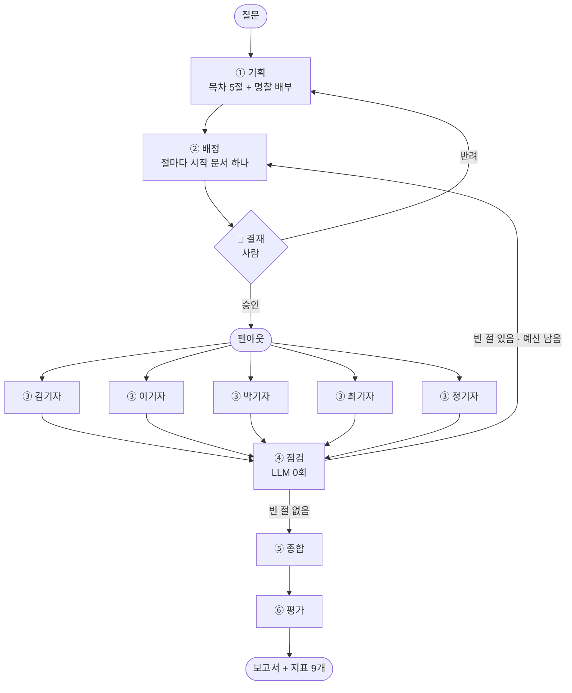

# REPORT — 마블 리서치 데스크

> 「9. 딥리서치 에이전트 만들기 [프로젝트]」 제출물 ·
> 배포 <https://mcu-deep-research.vercel.app> · 저장소 <https://github.com/elfinnani-byte/mcu-deep-research>

## 이 에이전트는 무엇을 하는가

MCU(마블 시네마틱 유니버스)에 대해 **한 문서로는 답이 안 나오는 질문**에 답하는
에이전트다. "인피니티 스톤을 둘러싼 사건들과 각각의 원인은?"처럼 답이 여러 영화에
흩어져 있어서, 하나를 읽어서는 절반밖에 못 쓰는 질문을 다룬다.

자료가 모델 창에 다 안 들어간다 — **154만 자로 128k 토큰 창의 약 3배**다. 그래서
편집장 하나가 다 읽고 쓰는 방식이 아예 불가능하다. 대신 **편집장이 목차를 절 다섯으로
쪼개고 기자 다섯에게 서로 다른 시작 문서를 나눠 준다. 기자는 각자 읽은 것만 손에 쥔 채
자기 절을 쓰고, 원문은 기자 함수 밖으로 나오지 않는다.** 편집장 창에 올라가는 것은
전체 읽은 글자의 **5.7%**뿐이다.

빈 절이 있으면 다시 내보내고, 그 전에 **사람이 목차를 보고 승인하거나 반려한다.**

그리고 **이 과정을 아이소메트릭 사무실로 보여준다.** 기자가 서고에서 문서를 꺼내면
막대에 불이 들어오고, 둘이 같은 문서를 읽으면 막대가 두 색으로 갈린다. 숫자로
「중복률 33%」인 것이 화면에서는 갈라진 막대 몇 개로 보인다.

## 결과 요약표

| 항목 | 결과 |
|---|---|
| 문서 수 / 총 글자 수 | 51건 / 1,543,251자 (모델 창의 약 3배) |
| 질문 세트 | 8건 (단일 2 · 다갈래 4 · 추적 2) · 녹화 5건 |
| 실행 기록 | 녹화 **34편** + 혼자 하는 대조군 **5편** (전부 실제 실행) |
| 근거가 달린 문장 (중앙값·33편) | 43.1% |
| 지어낸 인용 (중앙값·33편) | **0곳** |
| 편집장이 본 글 = 격리율 (중앙값·33편) | **5.7%** (경고선 30%를 넘은 편 **0**) |
| 인용이 엉뚱한 곳에 붙음 | 1 / 186곳 (0.5%) |
| 밟은 서고 (중앙값) | 3 / 7곳 |

<sub>중앙값은 **반려된 1편을 뺀 33편** 기준이다 — 사람이 목차를 반려해 다시 짠 실행이라 조건이 다르다.</sub>
| **구역 분할이 값을 하나** | ✅ **한다** — 끄면 5/5 질문에서 중복률 상승 |
| **역할(명찰)이 값을 하나** | ⏳ **판단 보류** — 차이 12~13%p < 잡음 14.3%p |
| **재위임이 값을 하나** | ⚠ **판정 불가** — 방향이 질문마다 뒤집힘 |
| **팀이 혼자보다 나은가** | ⚠ **못 가렸다** — 방향이 질문마다 뒤집히고 둘 다 잡음 안 |
| 1회 비용 / 전체 실험 비용 | 약 $0.025 / 약 $0.58 |

**숫자로는 거의 아무것도 못 가렸다.** 그래서 보고서 전문 5편을 읽고 판단을 따로 적었다
([`docs/읽고-판단.md`](docs/읽고-판단.md)) — 거기서는 결론이 갈렸다.

---

## 1. 무엇을 가지고 무엇을 물었나

### 코퍼스

영문 위키백과에서 자동 수집했다(`build_corpus.py`). 시드에서 링크를 따라 넓혀
**51건 / 1,543,251자**를 모았고, 화면의 서고 7개로 나뉜다.

| 서고 | 아이언맨 | 캡틴 아메리카 | 토르·헐크 | 어벤져스 | 우주·마법 | 뉴 제너레이션 | 세계관 허브 |
|---|---:|---:|---:|---:|---:|---:|---:|
| 문서 수 | 3 | 5 | 5 | 7 | 11 | 11 | 9 |

**왜 MCU인가**: 주제를 감으로 고르지 않고 네 조건으로 걸렀다 —
① 한 질문에 여러 자료가 필요한가(스톤 여섯 개가 각각 다른 영화에 있다)
② 자료가 모델 창을 넘는가(**3배**)
③ 자료끼리 서로를 가리키는가(위키 링크, 문서당 중앙값 8개)
④ 산출물이 장문인가(보고서 3,500~5,000자).

### 질문 8건 — 성격을 갈랐다

`data/questions.json` 한 곳에만 적는다. 질문마다 **「왜 나눌 만한가」**를 한 줄 적었고,
`tools/질문검사.py` 가 없는 문서·없는 서고·빈 칸·적어 둔 실측값이 실제 녹화와
다른지를 잡는다.

| 유형 | 뜻 | 몇 건 |
|---|---|---|
| 단일 | 한 건으로 답이 나온다 — **일부러 넣은 반례** | 2 |
| 다갈래 | 답이 여러 문서에 흩어져 있다 — 이 구조가 가장 맞는 유형 | 4 |
| 추적 | 한 대상을 따라 문서를 건너야 한다 | 2 |

**함정을 일부러 넣었다.** q3「아이언맨(2008)은 어떤 영화인가」는 문서 한 건이면
답이 되는 질문이다. 이 구조를 쓰면 안 되는 경우를 보이는 것도 프로젝트의 일부고,
실제로 **배정이 4번 빗나갔다**(6장 참고).

## 2. 어떻게 동작하는가



노드 여섯은 전부 `server/pipeline.py` 에 있다 — `plan()` `dispatch()` `researcher()`
`review()` `synthesize()` `evaluate()`. 조립은 `build()`.

### 분업을 어떻게 나눴나

**목차는 형식이 아니라 내용으로 나눈다.** 기획 프롬프트가
`"Split the outline by content units"` 를 요구한다 — 「개요·연표·분석」으로 나누면
다섯이 같은 자료를 읽게 되기 때문이다.

편집장이 질문을 보고 **축 하나**를 고르고 그 축의 명찰 다섯 장을 배부한다.

| 사건 축 (무슨 일이 있었나) | 작품 축 (어떻게 만들었고 얼마나 벌었나) |
|---|---|
| 큰그림 · 시간순 · 인물 · 원인 · 비교 | 스토리 · 제작 · 흥행 · 캐스팅 · 세계관 |

**배정**은 절마다 「먼저 읽을 문서」를 하나씩 정한다. 모델이 없는 제목을 지어내면
**코드가 바로잡고** 그 횟수를 남긴다. **구역**은 이미 다른 절에 준 문서를 주지 않고,
기자에게도 남의 시작 문서를 알려 준다. **예산**은 절마다 3건이고 코드가 센다.

### 폭·축·지표를 이렇게 정한 이유

| 정한 것 | 값 | 왜 |
|---|---|---|
| 절 수 × 절예산 | **5절 × 3건** | 코퍼스가 51건이라 다섯으로 갈라도 절마다 읽을 것이 남는다 |
| 역할 축 | **둘 — 사건 / 작품** | 자료가 「작품 × 측면」 두 방향으로 쪼개져 있다. 줄거리를 묻는 질문과 제작·흥행을 묻는 질문은 나눠야 할 갈래가 다르다 |
| 지표 | **9개** | 절이 다섯이라 구멍 날 자리가 많다. 특히 「근거 없는 절」은 전체 평균에 묻힌다 |

### 세 가지 결정과 그 이유

**① ⑤ 종합은 절 본문에 손대지 않는다.** 다시 쓰면 문체는 통일되지만 절 원고 전체가
편집장 창에 올라가 **격리가 마지막에 무너지고 인용이 샌다** — 원문을 본 적 없는 모델이
«문서 제목»을 근거가 아니라 장식으로 옮긴다.
대신 문체는 쓰는 자리에서 맞춘다 — ③ 조사 프롬프트가 어미를 지정한다.
그 대가는 5장에 있다 — 팀 원고에만 작품 제목이 한·영으로 섞인다.

**② 결재를 ② 배정 뒤에 둔다.** ①만 보면 목차만 보인다. ②까지 가야 어느 기자가 어느
문서부터 읽는지 정해진다. 배정이 틀렸을 때 사람이 되돌릴 수 있는 마지막 지점이 거기다.

**③ 두 번째 원고는 인용이 줄면 1바퀴를 지킨다.** 재위임은 빈 칸을 메우라고 보내는
것이지 다시 쓰라고 보내는 것이 아니다. 2바퀴가 보통 더 낫지만 **언제나**는 아니고,
더 나빠진 한 번에 멀쩡한 원고를 잃는 쪽이 나쁘다 — 잃은 것은 화면에도 지표에도 안 보인다.

### 멈추는 장치

에이전트는 **안 멈추는 쪽으로 고장난다.** 끊는 자리를 모아 둔다.

| 무엇을 막나 | 장치 | 값 |
|---|---|---|
| 그래프가 도는 것 | `한계()` → LangGraph `recursion_limit` | **최대바퀴로 계산** (2바퀴 → 11) |
| 재위임 / 반려가 도는 것 | `최대바퀴` / `최대반려` | 2 / 2 |
| 한 기자가 계속 읽는 것 | `절예산` — 코드가 센다 | 3건 |
| 모델이 안 답하는 것 | `ChatOpenAI(timeout=90, max_retries=0)` | 90초 |
| 일시적 오류 재시도 | `ask()` — **일시적인 것만** 3회 | 설정 오류는 즉시 드러낸다 |
| 함수가 오래 도는 것 / 동시 실행 | `maxDuration` / `실행중` Lock | 60초 / 1개(429) |
| 긴 질문 / 모델 입력 | `MAX_QUESTION` / `llm.CAP` | 200자 / 60,000자 |

`recursion_limit` 은 안 주면 **기본 25**가 걸린다. 우리 설정과 무관한 숫자라 바퀴를
늘리면 영문 모를 자리에서 터진다. 그래서 `최대바퀴`에서 계산해 준다.

**이상한 입력을 실제로 넣어 봤다** — 빈 질문·공백만·아무것도 안 보냄은 400,
5,000자 질문은 200자로 잘리고, 없는 프리셋은 기본으로 되돌아가고, 모르는 설정 열쇠는
버려지고, 프롬프트 인젝션 문장은 그냥 질문으로 취급된다.

## 3. 혼자 하는 것과 무엇이 다른가

분업이 값을 하는지 재려면 **혼자 하는 쪽**과 붙여야 한다.
공정성이 이 실험의 전부라 넷을 **코드로** 맞췄다.

| | 팀 | 혼자 |
|---|---|---|
| 자료 · 모델 · 도구 | corpus 51건 · gpt-4o-mini · 같은 함수 | **같음** |
| 읽기 예산 | 그 질문에서 실제로 읽은 횟수 | **같음** (q5는 26건) |
| 인용·문체 규칙 | `pipeline.인용규칙` | **같은 문자열** |
| 길이 요구 | 절마다 600자 × 5절 = 3,000자 | **3,000자** |
| 다른 것 | — | **나누지 않는다.** 하나가 순서대로 읽고 혼자 다 쓴다 |

읽기 예산이 이 실험의 핵심이다. `절수 × 절예산` 은 15인데 팀은 재위임 때문에 더 읽는다 —
**q5는 26건**이다. 15를 줬으면 예산의 58%만 주고 이긴 셈이 된다.
그리고 대조군이 예산을 다 안 쓰고 멈추지 않도록 **매 바퀴 강제로 고르게 했다**
— 처음 짰을 때는 모델이 "그만"이라 답하면 루프가 끊겨 예산의 3분의 1만 쓰고 멈췄다.
그 상태로 재면 팀이 압승한다. 당연하다, 상대는 손발이 묶인 것이다. 지금은 5/5 전부 예산을 다 쓴다.

## 4. 무엇으로 채점했나

정답표를 만들지 않았다. 51건·154만 자에 대한 정답을 사람이 쓸 수 없고, 쓴다 해도
그 답을 쓴 사람이 채점하게 된다. 대신 **답이 필요 없는 성질**만 센다.
판정 모델도 쓰지 않는다 — 전부 코드가 문자열로 센다.

| 지표 | 재는 것 | 어느 장치의 계기인가 | 경고선 |
|---|---|---|---|
| 근거가 달린 문장 | 문장 중 «출처»가 붙은 비율 | ③ 조사 · 재위임 | 50% 미만 |
| **근거 없는 절** | 출처가 한 곳도 없는 절 수 | ④ 점검 · 역할 프롬프트 | **0이 아니면** |
| **지어낸 인용** | 읽지 않은 문서를 출처로 적음 | (경보 전용) | **0이 아니면** |
| 바로잡은 인용 | 코드가 인용을 고치거나 지운 횟수 | `인용교정()` | 관찰값 |
| 엉뚱한 곳에 붙음 | 인용한 문서에 그 문장의 단서가 없음 | ③ 조사 | 참고값 |
| 한 문서에 쏠림 | 가장 많이 인용된 문서 하나의 비율 | ② 배정 | 50% 이상 |
| 겹쳐 읽음 | 둘 이상이 읽은 문서의 비율 | **구역 나누기** | 40% 이상 |
| 밟은 서고 | 인용이 몇 개 서고에 걸쳤나 | ② 배정 · 탐색 | 1/3 이하 |
| 편집장이 본 글 | 편집장 창에 올라간 글자 비율 | **컨텍스트 격리** | 30% 초과 |

**그물**은 0이어야 하는 둘뿐이다 — 「지어낸 인용」과 「근거 없는 절」.
그물을 통과해도 *"읽어 볼 만하다"* 는 뜻이지 *"좋은 보고서"* 라는 뜻이 아니다.

### 이 매핑을 어디까지 믿을 수 있나

표에 화살표를 그리는 것과 그 화살표가 실제로 있는 것은 다르다.
**장치를 꺼 보고 그 지표가 실제로 움직인 것만** 검증된 것이다.

| 검증됨 | 미검증 |
|---|---|
| 겹쳐 읽음 ← 구역 (끄면 5/5에서 상승) · 쏠림 ← 배정 (4/5) | 근거율 ← 역할(판단 보류) · 근거율 ← 재위임(판정 불가) · 격리율 ← 격리(**끄는 스위치가 없다**) · 근거 없는 절 ← 역할 프롬프트 |

## 5. 실제로 돌려본 결과

장치를 하나씩 꺼 본다. **질문 5개 × 설정 4가지 = 20편**(+ 반려 1 + 축 1),
여기에 반복 12편과 대조군 5편을 더해 **39편**을 돌렸다.

### 구역 — 값을 한다

| 기본 대비 | 질문 5개 중 |
|---|---|
| 중복률이 올랐다 | **5 / 5** |
| 쏠림이 올랐다 | 4 / 5 |
| 읽은 문서가 줄었다 | 12.0건 → **7.4건** |

q3는 구역을 끄니 기자 다섯이 **15번 읽어 문서 3건**만 봤다 — 아이언맨 1·2·3편뿐이다.
방향이 질문마다 뒤집히지 않는 유일한 장치다.

### 역할(명찰) — 판단 보류

n=1 표로는 다섯 질문 **전부** 명찰을 끈 쪽이 높았다(평균 +13.0%p).
그래서 결론 대신 **사전등록**을 썼다 — 돌리기 **전에** 판정 규칙을 커밋하고
([`docs/사전등록.md`](docs/사전등록.md)), 집계는 `tools/반복분석.py` 가 그 규칙을
코드로 돌린다. 3회가 안 차면 스스로 판정을 거부한다.

q2·q5를 칸당 3회씩 다시 떴다(12편 · $0.34).

| 칸 | 3회 근거율 | 중앙값 | 폭 |
|---|---|---:|---:|
| q2-기본 | 35.8 · 31.2 · 28.3 | 31.2 | 7.5 |
| q2-역할끔 | 44.7 · **28.3** · 43.8 | 43.8 | **16.4** |
| q5-기본 | **12.5** · 27.3 · 31.4 | 27.3 | **18.9** |
| q5-역할끔 | 28.6 · 40.8 · 43.1 | 40.8 | 14.5 |

```
q2 차이 +12.6   ·   q5 차이 +13.5   ·   잡음(칸별 최대−최소 평균) 14.3%p
→ 판단 보류 — 기본값을 켠 채 두고, 못 정했다고 적는다
```

**방향은 2/2 같은데 차이가 같은 칸 안의 흔들림보다 작다.** `q2-역할끔` 은 아무것도
안 바꾸고 28.3과 44.7이 나온다. n=1 표가 틀린 것은 아니고 **못 믿을 것**이었다 —
말할 수 없는 것은 **크기**다.

> 미리 정해 둔 규칙이 아니었다면 이 숫자를 보고도 *"방향이 2/2로 같으니 역할은 해롭다"*
> 고 썼을 것이다. **사전등록이 실제로 막은 것은 남이 아니라 나였다.**

### 팀 vs 혼자 — 못 가렸다

| | 팀 | 혼자 | 차이 | 팀 칸 흔들림 폭 | |
|---|---:|---:|---:|---:|---|
| q2 근거율 | 31.2 | **35.7** | 혼자 +4.5 | 7.5 | 잡음 내 |
| q5 근거율 | **27.3** | 14.6 | 팀 +12.7 | 18.9 | 잡음 내 |
| q2 쏠림 | 33.3 | **13.3** | 혼자 −20.0 | 3.3 | **잡음 밖** |
| q2 보고서자수 | **3,648** | 2,076 | 팀 +1,572 | 312 | **잡음 밖** |

근거율은 **질문마다 방향이 뒤집힌다.** 이 과제의 전제를 재려던 실험인데
**검증도 반증도 못 했다.**

잡음 밖에서 분명한 것은 둘이다. **쏠림은 혼자가 낫다** — 읽은 것이 전부 한 창에 있어
인용을 고르게 퍼뜨린다. **길이는 팀이 1,500자 이상 더 쓴다** — 둘 다 3,000자를
요구했고 출력 상한도 안 걸었는데, **혼자 하는 쪽은 시켜도 1,300~2,500자만 쓴다.**
같은 총량을 요구해도 한 번에 시키는 것과 다섯 번에 나눠 시키는 것이 다르다.

> 분업이 만든 차이로 잡아낸 것은 「더 정확하다」가 아니라 **「더 많이 쓴다」** 였다.

### 서고 커버리지 — 일곱 중 셋만 밟는다

근거율은 한 문서만 되풀이 인용해도 오른다. **어디서** 가져왔나를 따로 센다.

팀 34편도 혼자 5편도 **중앙값 3/7**이다. 분업이 코퍼스를 더 넓게 밟게 만들지 못했다.

```
39편 중 그 서고를 한 번이라도 인용한 편수
  세계관 허브 36 · 어벤져스 33 · 캡틴 아메리카 21 · 뉴 제너레이션 17 ·
  우주·마법 12 · 아이언맨 11 · 토르·헐크 1
```

5건짜리 서고 하나가 **39편 중 단 한 편**에만 나온다. 원인은 우리 코드에 있다 —
폴백이 링크가 가장 많은 문서를 고르고, 기자의 탐색도 링크를 따라가므로 **둘 다 허브로
빨려 든다.** 코퍼스 51건 중 21건이 한 번도 안 읽힌 것과 같은 현상이다.

### 숫자로 못 가려서 — 읽었다

역할도 보류, 팀 대 혼자도 보류. 그래서 보고서 전문 5편을 나란히 읽고 판단을 적었다
그물로 걸렀으니 이제 눈으로 골라야 한다. 전문은 [`docs/읽고-판단.md`](docs/읽고-판단.md).

| 짝 | 숫자 | **읽은 판단** |
|---|---|---|
| q5 팀 ↔ 혼자 | 근거율 팀 27.3 vs 14.6 (**팀 2배**) | **혼자가 낫다** |
| q2 팀 ↔ 혼자 | 근거율 혼자 35.7 vs 31.2 | 혼자가 낫다 |
| q5 명찰 켬 ↔ 끔 | 근거 없는 절 3 vs 1 | 끈 쪽이 낫다 |

**q5에서 숫자와 판단이 갈린다.** 근거율은 팀이 두 배인데 읽으면 혼자가 낫다.

- 질문은 「어떻게 이어지는가」인데 **팀은 7절 중 1절만 연결을 다룬다.** 나머지는
  페이즈별 영화 목록이다. 혼자는 2절을 연결에 쓴다.
- **팀의 근거는 절 4·5에만 몰려 있고 절 1~3은 0곳**이다. 혼자는 7절 전부에 있다.
  → **근거율은 「얼마나」만 보고 「어디에」를 안 본다.**
- 팀의 한 절은 스스로 실패를 적는다 — *"…정보는[5] 문서에 포함되어 있지 않습니다"*
  그러고는 다른 이야기를 쓴다.

> **팀이 지는 자리는 조사가 아니라 목차다.** 그 절을 빼고 절 1~3을 합치면 팀이 낫다.

그리고 **다섯째 절은 명찰과 무관하게 무너진다** — 켠 쪽도 끈 쪽도 마지막 절이 제목과
다른 내용이다. ② 배정이 앞 네 절에 알맹이를 다 준다.

**지표가 못 보는 것도 읽어야 보였다.** 절끼리 글자가 겹치는 정도는 34편 중앙값 **0.0%**
인데, 읽으면 같은 사실이 되풀이된다(「페퍼 포츠」가 1·3·4절, 「PTSD」가 1·3·4절).
**지표는 표현의 중복만 보고 사실의 중복은 못 본다.**

## 6. 실패했을 때 무엇이 문제였나

열 건을 **증상 → 첫 의심 → 확인 → 진짜 원인 → 교훈** 형식으로 남겼다
([`docs/실패기록.md`](docs/실패기록.md)). 여기에는 넷만 옮긴다.

**① 인용이 틀려 보였는데 틀린 것은 우리가 붙인 제목이었다.**
«Ant-Man (film) — **Music**» 을 근거로 로튼토마토 83%를 적은 문장이 걸렸다. 원문을
열었더니 **있었다.** `build_corpus.py` 가 `== Music ==` 에서 자르고 그 뒤 전부를 넣어서,
그 조각이 Reception·Box office·Critical response 를 다 담고 있다. 같은 식으로 잘린 조각이
**51건 중 28건(55%)** 이다. 그리고 그 제목을 믿고 만든 회피 규칙이 코드에 있었다 —
폴백은 「— Reception」을 늘 피하는데 배정 프롬프트는 작품 축이면 "오히려 알맹이"라고 한다.
**프롬프트와 코드가 반대를 가리켰다.**

**② 대조군을 예산이 아니라 프롬프트로 묶어 놨다.**
읽기 예산은 코드로 맞춰 놓고 **길이는 안 맞췄다** — 팀 3,000자, 혼자 2,000자.
그 표는 5/5 전부 팀이 이겼고, **이겼기 때문에 의심하지 않았다.** 맞춰 다시 뜨니
근거율 방향이 뒤집혔다. 틀린 5편은 지우지 않고 `runs/길이불일치/` 에 남겼다.

**③ 키를 잘못 넣은 방문자에게 스택 트레이스를 보여 주고 있었다.**
채점하는 사람이 처음 하는 일이 키를 넣는 것인데, 오타가 났을 때 무엇이 보이는지
본 적이 없었다. HTTP 500 + 트레이스였고, **키 꼬리까지 새어 나왔다** —
우리 마스킹 정규식이 OpenAI가 별표로 가린 키를 못 지웠다. 이제 401 + 한 줄이다.

**④ 라이브에서 스위치를 꺼도 켜진 채 돌고 있었다.**
설정을 씌우는 한 줄이 `bool` 을 `int` 보다 나중에 봤다. 파이썬에서 `bool` 은 `int` 의
하위형이라 `역할=False` 가 `max(1, min(8, 0))` = **1**이 됐다. 스위치 다섯 개 전부.
녹화는 다른 경로를 타서 무사했다.

> 넷의 공통점 하나 — **우리가 안 가 본 길은 썩어 있었다.** ①은 제목을 의심 안 한 길,
> ②는 이겨서 안 판 길, ③은 키가 틀린 길, ④는 라이브로 스위치를 끈 길이다.

### 고친 것 — 전 → 후

| 무엇 | 전 | 후 |
|---|---|---|
| ④ 점검이 빈 절을 잡는 범위 | 진짜 빈 절의 **38%** | **100%** |
| 「엉뚱한 곳에 붙음」 헛경보 | 3곳 중 **2곳이 거짓** | 3곳 → **1곳** |
| 대조군 길이 요구 | 혼자에게 2,000자만 | 둘 다 3,000자 (**결론이 뒤집힘**) |
| 대조군 읽기 예산 | `절수×절예산` = 15건 | **팀 실측**(q5는 26건) |
| 키가 틀렸을 때 | 500 + 스택 + 키 노출 | **401 + 한 줄** |
| 라이브 스위치 | `역할=False` 가 **1**(참) | 그대로 False |
| 폭주 방지 | LangGraph 기본 **25** | `최대바퀴`로 계산 (2바퀴 → 11) |

**고쳤는데 나빠진 것도 적는다.** 「인용 0곳이면 되돌려 보낸다」를 넣었더니
근거 없는 절이 1.00 → **1.25개로 늘었다.** `최대바퀴` 가 2라 되돌려 보낼 기회가
한 번뿐이고, 그 한 번으로 못 메운다. **되돌려 보내는 것과 메워지는 것은 다른 일이었다.**

## 7. 데모로 직접 확인하기

<https://mcu-deep-research.vercel.app> — **키가 없어도 실행 기록 34편을 그대로 재생한다.**


서고 7개가 벽에 붙어 있고 **막대 하나가 문서 한 건**이다. 기자가 읽으면 그 막대에
기자 색으로 불이 들어온다. 두 기자가 같은 문서를 읽으면 **막대가 두 색으로 갈리고**(중복),
읽었는데 쓸 게 없었으면 **끊어진다**(헛읽음).

| | |
|---|---|
|  | **🔏 결재** — ② 배정이 끝나면 멈춘다. 목차·명찰·시작 문서를 한 화면에서 보고 승인하거나 반려한다. 반려하면 목차부터 다시 짠다 |
|  | **보고서** — 본문에는 번호만 두고 문서 제목은 맨 끝 참고자료로 모은다. 글자수는 참고자료를 뺀 본문만 센다 |
|  | **재생** — 34편을 늘어놓지 않고 **질문 × 설정** 두 축으로 고르게 했다. 같은 설정을 여러 번 돌린 기록은 따로 묶어 **흔들리는 폭**을 보이고, 코드 세대가 다른 기록은 *"나란히 재면 안 됩니다"* 라고 말한다 |

주소로도 부른다 — `?replay=q4-역할끔&report=1` 이면 그 녹화의 보고서가 열린 채로 뜬다.

**화면에서 잡은 버그 넷**: 기자가 서고에 닿기 전에 막대에 불이 들어온 것 ·
서고 이름표가 겹친 것(원인은 지그재그가 아니라 **랙 높이**였다) ·
라이브가 결재에서 영영 멈춰 있던 것 · 보고서에 「[8]는 …」처럼 주어가 숫자였던 것.
마지막 것은 고치다 **더 크게 망가뜨렸다가** 캡처를 떠서 보고 되돌렸다.

## 8. 한계와 회고

### 가장 공들인 부분 — 「못 믿을 숫자」를 못 믿게 만드는 일

코드보다 **측정을 의심하는 장치**에 시간을 더 썼다.

- **사전등록** — 돌리기 전에 판정 규칙을 커밋하고, 녹화 파일에 그 커밋 해시를 박는다.
  3회가 안 차면 집계 도구가 **판정을 거부한다.**
- **세대 자동 구분** — 설정 열쇠 유무로 옛 코드 실행을 집계에서 뺀다. 손으로 표시하지 않는다.
- **잡음을 늘 같이 보인다** — 차이 옆에 칸의 흔들림 폭을 찍고, 차이가 폭 안이면
  「이겼다」로 세지 않는다.
- **못 재는 것은 0으로 적지 않는다** — 혼자 하는 쪽에 성립하지 않는 지표 셋은 빼고 이유를 적는다.

이 장치들이 **실제로 나를 막았다.** n=1로 「역할은 해롭다」를 쓸 뻔했고, 길이를 안 맞춘
대조군으로 「팀이 이겼다」를 쓸 뻔했다. 둘 다 **이겼기 때문에 덜 의심했다.**

### 고치지 못한 것

1. **팀이 혼자보다 나은지 못 가렸다.** 이 과제의 전제를 검증도 반증도 못 했다.
   질문 둘로는 모자라고 혼자 쪽도 칸당 1회뿐이다.
2. **반복은 q2·q5 두 질문에만 했다.** 3회로도 잡음(14.3%p)이 차이(12~13%p)보다 크다.
3. **코퍼스 제목이 51건 중 28건 내용을 잘못 말한다.** 고치려면 `corpus.json` 을 다시
   만들어야 하고 녹화 34편이 전부 무효가 된다 — 이번 제출에서는 하지 않는다.
4. **되돌려 보내는 것과 메워지는 것을 못 이었다.** ④ 가 더 잡게 만들었을 뿐
   ③ 이 더 잘 메우게 만들지는 못했다. `최대바퀴` 를 3으로 올려 보는 것이 다음 실험이다.
5. **다섯째 절이 늘 빈다.** 절 수를 질문에 맞춰 정해야 한다.
   절 제목이 명찰과 같은지 코드가 검사하지도 않는다.
6. **겹쳐 읽는 문제를 못 고쳤다.** 구역을 나눠도 q3는 중복률 100%가 나온다.
7. **「엉뚱한 곳에 붙음」은 인용 문장의 33%만 판정한다.** 본문이 한국어라서다.
8. **진짜 키로 라이브를 끝까지 돌려본 적이 없다.** 가짜 모델·가짜 SSE로 전 구간이
   흐르는 것과, 잘못된 키 처리는 확인했다.

## 9. 돌려보는 법

```bash
cd web && python serve.py              # 키 없이 — 녹화 34편 + 대조군 5편

pip install -r requirements.txt
cp server/.env.example server/.env     # OPENAI_API_KEY
python -m server.pipeline "질문"        # 1회 약 $0.025 · 1~3분
python -u server/baseline.py q1        # 혼자 하는 대조군

python tools/질문검사.py   python tools/반복분석.py
python tools/팀대혼자.py   python tools/배포검증.py
```

| 더 읽을 것 | |
|---|---|
| [`docs/읽고-판단.md`](docs/읽고-판단.md) | 보고서를 나란히 읽고 내린 판단 |
| [`docs/실패기록.md`](docs/실패기록.md) | 실패 10건 전문 |
| [`docs/사전등록.md`](docs/사전등록.md) | 반복 녹화 **전에** 못박은 판정 규칙 |
| [`docs/절제실험-결과.md`](docs/절제실험-결과.md) | 설정별 수치 전체 |
| [`docs/구조도.md`](docs/구조도.md) | 그림 다섯 장 (4층 · 6노드 · 두 번 호출 · 모듈 · 도구) |
| [`docs/과제명세-대조.md`](docs/과제명세-대조.md) | 과제 필수 5단계·루브릭과 한 줄씩 맞춘 표 |

---

## 부록 — 제출물 대응표

과제 예시 트리와 구조가 다르다. 화면(`web/`)과 파이프라인(`server/`)을 갈라 두었고,
서버리스 함수를 따로 뒀다.

| 과제 예시 | 이 저장소 | 비고 |
|---|---|---|
| `data/corpus.json` | **`corpus.json`** (루트) | docs + links · 51건 · 1,543,251자 |
| `data/questions.json` | [`data/questions.json`](data/questions.json) | 질문 8건 + 「왜 나눌 만한가」 + 유형 |
| `config.json` | `server/pipeline.py` 의 `설정` · `ROSTER` | 절수·절예산·바퀴 상한·스위치 6개·역할 명단 |
| `graph.py` | `server/pipeline.py` `build()` · 노드 6개 | 조립과 노드가 한 파일 |
| `metrics.py` | `evaluate()` + `web/js/config.js` `DASH` | 지표 9개 · 그물 판정 |
| `ablation.py` | [`server/batch.py`](server/batch.py) · [`server/repeat.py`](server/repeat.py) | 20편 / 반복 12편 |
| `baseline.py` | [`server/baseline.py`](server/baseline.py) | 예산을 팀 실측에 맞춘다 |
| `app.py` | `web/` + `api/plan.py` · `api/run.py` | 의존성 0 Canvas · 배포까지 |
| `output/` | `web/replay/` 34편 + `runs/` 5편 | 전부 실제 실행 기록 |
| `REPORT.md` | 이 문서 | |

프롬프트 전문은 `server/pipeline.py` 안에 있다 — 기획 `_기획요청()` · 배정 `배정()` ·
읽기 `요약()` · 다음 문서 `다음문서()` · 쓰기 `researcher()` · 종합 `synthesize()` ·
대조군 `baseline.혼자()` · 공통 인용 규칙 `인용규칙`(팀과 혼자가 **같은 문자열**).
