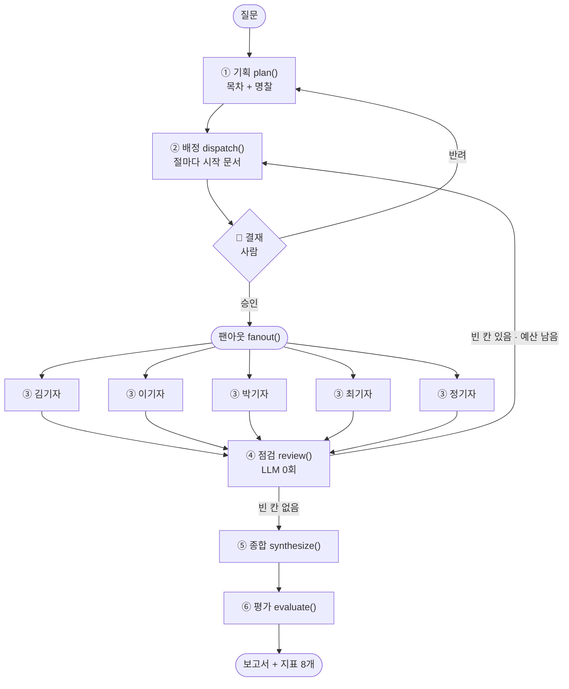
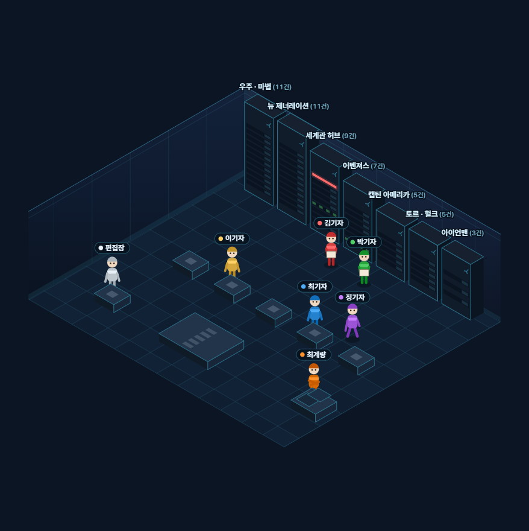
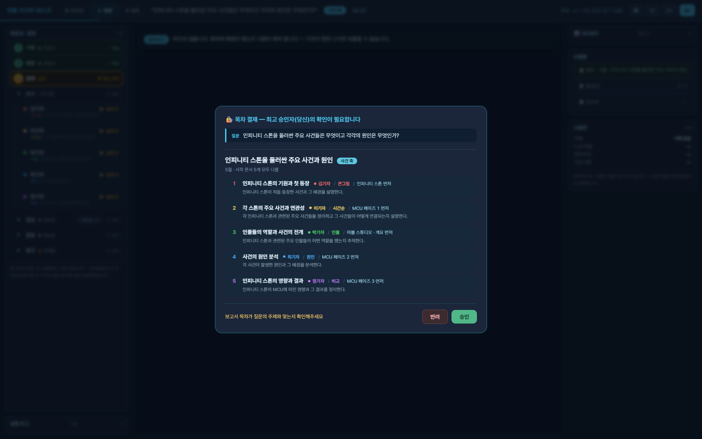
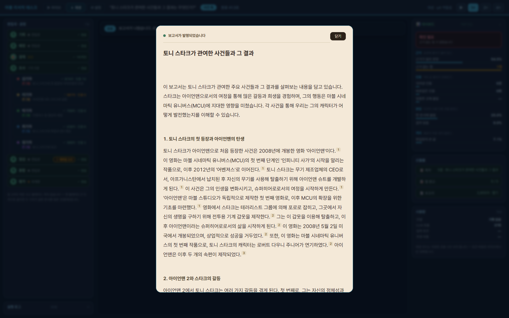
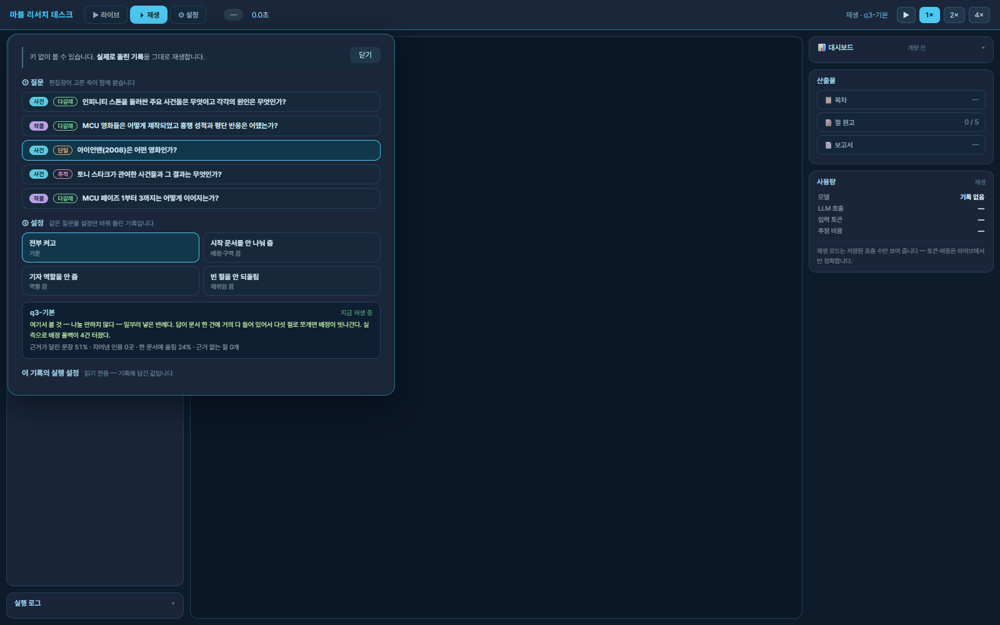

# 마블 리서치 데스크 — 과제 보고서

> 「8. 딥리서치 에이전트 만들기 — 오케스트레이션」
> 배포 <https://mcu-deep-research.vercel.app> · 저장소 <https://github.com/elfinnani-byte/mcu-deep-research>

---

## 0. 한 줄로

질문 하나를 **편집장이 목차로 쪼개고, 기자 5명이 동시에 자료를 읽어 각자 한 절씩 써 오고,
빈 곳을 찾아 다시 보내는** 딥리서치 에이전트다. 그리고 **그 과정을 아이소메트릭 사무실로 보여준다.**

만든 것은 셋이다.

| | |
|---|---|
| **파이프라인** | LangGraph 6노드 + 사람 결재 게이트. `server/pipeline.py` 776줄 |
| **무대** | 이벤트를 받아 그리는 4층 구조. `web/js/` 11개 모듈 · 2,257줄 |
| **측정** | 정답표 없이 재는 지표 8개 + 절제 실험 22편 |

코퍼스는 MCU 영문 위키백과 **51건 · 1,543,251자** (실측 — `corpus.json`).

**키가 없어도 전부 볼 수 있다.** 실제로 돌린 기록 22편이 저장소에 들어 있다.
`?replay=q4-역할끔&report=1` 처럼 주소로 바로 부를 수 있다.

---

> **작성 가이드 6항목이 어디에 있나** — 주제와 코퍼스 §0.5 · 분업 설계 §2.5 · 지표 §3 ·
> 파이프라인 구조도 §1.5 · 데모 설계 §8(캡처 4장) · 프로젝트 회고 §9.
> 제출물 트리 대응표는 맨 끝 부록. 돌려보는 법은 §10.
>
> **루브릭 1번**(나란히 읽고 판단 · 대목 추적)은 §4.6 과 §5.7, 전문은
> [`docs/읽고-판단.md`](docs/읽고-판단.md).

---

## 0.5 주제와 코퍼스 — 무엇을 왜 골랐나

강의는 한국 근대사를 썼다. 배운 것은 역사가 아니라 **분업**이므로 도메인을 바꿨다.
주제를 감으로 고르지 않고 **네 조건으로 걸렀다** (계획서 2장).

| 조건 | 왜 | MCU 는 |
|---|---|---|
| 한 질문에 여러 자료가 필요하다 | 한 건으로 답이 나오면 나눌 이유가 없다 | 인피니티 스톤 여섯 개가 각각 다른 영화에 있다 |
| 자료 전체가 모델 창에 안 들어간다 | 들어가면 그냥 다 넣으면 된다 | **1,543,251자 = 128k 토큰 창의 약 3배** |
| 자료끼리 서로를 가리킨다 | 기자가 한 건을 읽고 다음 후보를 찾아야 한다 | 위키 링크 — 문서당 중앙값 8개 |
| 산출물이 장문이다 | 한 문단이면 절을 나눌 일이 없다 | 보고서 3,500~5,000자 |

**모델 창의 3배**가 이 프로젝트의 전제다. 그래서 `격리율` 을 매번 잰다 — 원문이 편집장
창으로 새면 그 전제가 무너진다. 실측 2~5%.

코퍼스는 영문 위키백과 **51건**이고, 화면의 서고 7개로 나뉜다
(아이언맨 3 · 캡틴 아메리카 5 · 토르·헐크 5 · 어벤져스 7 · 우주·마법 11 · 뉴 제너레이션 11 · 세계관 허브 9).
질문은 **8건**이고 성격을 갈랐다 — 단일 2 · 다갈래 4 · 추적 2 (`data/questions.json`).
질문마다 「왜 나눌 만한가」를 한 줄 적었고, `tools/질문검사.py` 가 없는 문서·없는 서고·
빈 칸·적어 둔 실측값이 실제 녹화와 다른지를 잡는다.

**한 건으로 답이 나오는 질문을 일부러 둘 넣었다** — q3(아이언맨 2008)·q6(블랙 팬서 홍보).
이 구조를 쓰면 안 되는 경우를 보이는 것도 프로젝트의 일부다. q3는 실측으로 배정 폴백이
4건 터졌다.

---

## 1. 강의를 어디에 구현했나

강의가 이름 붙인 것을 코드의 어디에 놓았는지다. **추측이 아니라 파일:줄**이다.

| 강의의 개념 | 우리 코드 |
|---|---|
| ① 기획 (Planner) | `server/pipeline.py:291` `plan()` |
| ② 배정 (Dispatcher) | `server/pipeline.py:364` `dispatch()` |
| ③ 조사 ×5 (팬아웃) | `server/pipeline.py:414` `fanout()` → `:499` `researcher()` |
| 도구 호출 | `:431` `요약()` — 문서 한 건을 읽고 간추린다 |
| 다음 문서 고르기 | `:447` `다음문서()` — 읽은 것의 링크가 다음 후보다 |
| ④ 점검 (정반송) | `server/pipeline.py:559` `review()` — **LLM 0회** |
| 재위임 루프 | `:591` `route()` → `dispatch` 로 되돌림 |
| ⑤ 종합 | `server/pipeline.py:596` `synthesize()` |
| ⑥ 평가 | `server/pipeline.py:624` `evaluate()` |
| 그래프 조립 | `server/pipeline.py:670` `build()` |

**④ 점검은 모델을 부르지 않는다.** 세고 되돌려 보낼 뿐이다. 판정을 모델에 맡기면
절제 실험의 숫자가 모델 기분을 타게 되고, 그러면 무엇을 껐을 때 무엇이 달라졌는지
말할 수 없다 (14강 — 채점은 코드로).

**격리**는 지켰다. 원문은 `researcher()` 밖으로 나가지 않는다. 편집장이 보는 것은
문서 앞 250자 카드뿐이고, 그 비율을 `격리율` 로 매번 잰다.

---

## 1.5 파이프라인 구조도



**State(`Research`)가 노드 사이로 나르는 것** — `question` · `plan{제목,축,목차,배치,바퀴}` ·
`sections[]`(절 원고·읽은문서·메모·인용) · `visited[]` · `report` · `metrics` · `log[]`.
`sections` 는 **덧붙이기(add)** 라 재위임되면 같은 절이 두 번 쌓이고,
`절모음()` 이 **인용이 줄지 않은 쪽**을 골라 준다 (§2.5).

절 원고의 **원문은 `researcher()` 밖으로 나가지 않는다.** 편집장이 보는 것은 문서 앞 250자
카드와 절 제목·첫머리뿐이고, 그 비율이 `격리율` 이다.

층 구조와 모듈 의존까지 그린 것은 [`docs/구조도.md`](docs/구조도.md) 에 있다 (mermaid 5장).

---

## 2. 강의에서 바꾼 것 — 넷

임의로 바꾸지 않았다. 바꿨다면 그건 실험이 아니라 다른 프로젝트다.

| 바꾼 것 | 강의 | 우리 | 왜 |
|---|---|---|---|
| 폭 | 4절 × 3건 | **5절 × 3건** | 코퍼스가 51건으로 더 크다 |
| 역할 축 | 하나 | **둘 — 사건 / 작품** | 자료가 「작품 × 측면」 두 방향으로 쪼개져 있다 |
| **결재 게이트** | 없음 | **② 배정 뒤에 있음** | 4강 *"배정이 틀리면 보고서가 멀쩡해 보인다"* 를 사람이 잡는 자리 |
| 지표 | 6개 | **8개** | 절이 다섯이라 구멍 날 자리가 더 많다 |

### 결재 게이트를 왜 ② 뒤에 두었나

①만 보면 목차만 보인다. ②까지 가야 **어느 기자가 어느 문서부터 읽는지**가 정해진다.
배정이 틀렸을 때 사람이 되돌릴 수 있는 마지막 지점이 거기다.

승인하면 기자들이 나가고, 반려하면 **목차부터 다시 짠다** — 반려 사유를 실어서.
반려 분기도 실제로 녹화해 두었다 (`web/replay/q1-반려.json`).

이 때문에 서버리스에서는 **함수를 두 번 부른다.** 사람이 고민하는 동안에도
함수는 실행 시간을 태우기 때문이다. `POST /api/plan` 이 ①②만 돌리고 끝나고,
승인 뒤 `POST /api/run` 이 ③부터 잇는다. **②를 다시 돌리지 않는다** — 승인한
시작 문서가 바뀌면 결재가 헛것이 된다.

---

## 2.5 분업 설계

### 서브에이전트를 나누는 규칙 넷

1. **내용 단위로 나눈다.** 기획 프롬프트 STEP 2 — `"Split the outline by content units"`.
   형식(개요·연표·분석)으로 나누면 전원이 같은 자료를 읽는다.
2. **한 절 = 한 기자 = 한 노드.** 절이 다섯이면 기자가 다섯이고 동시에 나간다.
3. **원문은 아래 남고 위로는 원고만 올라간다.** 기자는 문서 전문을 읽고 요약만 상태에 넣는다.
4. **남의 구역을 알려 준다.** 각 기자는 `피하기` 로 다른 절의 시작 문서를 받는다.

### 역할 명단 — 축 둘 × 명찰 다섯

편집장이 질문을 보고 **축 하나**를 고르고, 그 축의 명찰 다섯 장을 배부한다.

| 사건 축 (무슨 일이 있었나) | 작품 축 (어떻게 만들었고 얼마나 벌었나) |
|---|---|
| 큰그림 · 시간순 · 인물 · 원인 · 비교 | 스토리 · 제작 · 흥행 · 캐스팅 · 세계관 |

강의는 축이 하나인데 우리는 둘로 늘렸다 — 자료가 「작품 × 측면」 두 방향으로 쪼개져 있어서다.
**실측으로 작품 축에서는 명찰이 잘 갈리지 않는다** (사건 축 5.0/5 · 작품 축 2.6/5,
역할 끈 실행 제외). 특히 q5는 3편 모두 한 명찰로 몰린다 — 축이 아니라 **질문의 문제**다.

### 배정·구역 규칙

- **배정** — ② 배정 담당이 절마다 「먼저 읽을 문서」를 하나씩 고른다. 모델이 없는 제목을
  지어내면 **코드가 바로잡고**(`d not in DOCS`) 그 횟수를 `dispatch.fallback` 으로 남긴다.
- **구역** — 이미 다른 절에 준 문서는 주지 않는다(`taken`). 기자에게도 남의 시작 문서를
  `피하기` 로 알려 준다.
- **예산** — 절마다 3건. 다 쓰기 전에는 못 멈추고, 다 쓰면 더 못 읽는다. 코드가 센다.
- **재위임** — ④ 점검이 빈 절만 ②로 되돌린다. 바퀴 상한 2.

### 두 번째 원고를 어떻게 할지

재위임으로 같은 절이 두 번 올라오면 **인용이 줄지 않은 쪽**을 남긴다(`절모음()`).
읽은 기록은 언제나 나중 것을 쓴다(2바퀴가 1바퀴의 상위집합).

재위임은 **빈 칸을 메우라고** 보내는 것이지 다시 쓰라고 보내는 것이 아니다. 2바퀴가 보통
더 낫지만 **언제나**는 아니고, 더 나빠진 한 번에 멀쩡한 원고를 잃는 쪽이 나쁘다 —
잃은 것은 화면에도 지표에도 안 보인다. 지킨 횟수는 `원고지킴` 으로 센다.

### ⑤ 종합은 절 본문에 손대지 않는다

12강의 네 선택지 중 **①(그대로 이어 붙이고 머리말·맺음말만)** 을 골랐다.
다시 쓰면 문체는 통일되지만 **격리가 마지막에 무너지고 인용이 샌다.**
대신 문체는 **쓰는 자리에서** 맞춘다 — ③ 조사 프롬프트가 어미를 지정한다.

그 대가는 §4.6에 있다 — **팀 원고에만 작품 제목이 한국어·영어로 섞인다.**

---

## 3. 어떻게 쟀나

정답표를 만들지 않았다. 51건 · 154만 자에 대한 정답을 사람이 쓸 수 없고,
쓴다 해도 그 답을 쓴 사람이 채점하게 된다. 대신 **답이 필요 없는 성질**만 센다.

### 지표 8개 — 각각 **어느 장치의 계기인가**

계기판에 숫자를 늘어놓는 것으로는 부족하다. 값이 나쁠 때 **어디를 고쳐야 하는지**
말해 주지 못하면 그 지표는 없는 것과 같다. 그래서 지표마다 붙는 장치를 적어 둔다.

| 지표 | 재는 것 | 어느 장치의 계기인가 | 나쁘면 어디를 만지나 | 경고선 |
|---|---|---|---|---|
| 근거가 달린 문장 | 문장 중 «출처»가 붙은 비율 | ③ 조사의 인용 규칙 · 재위임 | ③ 쓰기 프롬프트 · 절예산 | 50% 미만 |
| **근거 없는 절** | 출처가 한 곳도 없는 절 수 | ④ 점검 · 역할 프롬프트 | `인용0곳점검` · 명찰 문구 | **0이 아니면** |
| **지어낸 인용** | 읽지 않은 문서를 출처로 적음 | — (경보 전용) | `인용교정()` | **0이 아니면** |
| 바로잡은 인용 | 코드가 인용을 고치거나 지운 횟수 | `인용교정()` 이 얼마나 일했나 | ③ 쓰기 프롬프트 | 없음 (관찰값) |
| 엉뚱한 곳에 붙음 | 인용한 문서에 그 문장의 단서가 없음 | ③ 조사 — 읽은 것과 쓴 것이 맞나 | ③ 쓰기 프롬프트 | 참고값 |
| 한 문서에 쏠림 | 가장 많이 인용된 문서 하나의 비율 | ② 배정 | 배정 프롬프트 · 폴백 규칙 | 50% 이상 |
| 겹쳐 읽음 | 둘 이상이 읽은 문서의 비율 | **구역 나누기** | `피하기` 전달 방식 | 40% 이상 |
| 편집장이 본 글 | 편집장 창에 올라간 글자 비율 | **컨텍스트 격리** | ⑤ 종합이 절 본문을 읽나 | 30% 초과 |

**그물**은 0이어야 하는 둘뿐이다 — 「지어낸 인용」과 「근거 없는 절」.
그물을 통과해도 *"읽어 볼 만하다"* 는 뜻이지 *"좋은 보고서"* 라는 뜻이 아니다.
순위는 사람이 읽고 매긴다.

### 이 매핑을 어디까지 믿을 수 있나

표에 화살표를 그리는 것과, 그 화살표가 실제로 있는 것은 다르다.
**장치를 꺼 보고 그 지표가 실제로 움직인 것만** 검증된 것이다.

| 매핑 | 상태 |
|---|---|
| 겹쳐 읽음 ← 구역 나누기 | ✅ **검증** — 구역을 끄면 5/5 질문에서 올랐다 (Q1 18.2% → 66.7%) |
| 한 문서에 쏠림 ← 배정 | ✅ **검증** — 4/5 질문에서 올랐다 |
| 근거가 달린 문장 ← 역할 | ⏳ **미정** — n=1 로는 못 믿는다 (4.3) |
| 근거가 달린 문장 ← 재위임 | ⚠ **판정 불가** — 방향이 질문마다 뒤집힌다 |
| 편집장이 본 글 ← 격리 | ⚠ **미검증** — 격리를 **끄는 스위치가 없다.** 설계상 참이지만 실험으로 보인 적은 없다 |
| 근거 없는 절 ← 역할 프롬프트 | ⚠ **미검증** |

**「엉뚱한 곳에 붙음」은 그물이 아니다.** 본문이 한국어고 문서는 영문 위키라
대조되는 문장이 33%뿐이다. 그래서 분모를 반드시 같이 보인다 (`1/186곳`).

---

## 4. 결과

절제 실험 — 장치를 하나씩 꺼 보고 무엇이 실제로 값을 하는지 본다 (15강).
**질문 5개 × 설정 4가지 × 1회 = 20편** (+ 반려 1편 + 축이 갈린 1편 = 22편).

### 4.1 구역 분할 — **값을 했다**

| 기본 대비 | 질문 5개 중 |
|---|---|
| 중복률이 **올랐다** | **5 / 5** |
| 편중이 올랐다 | 4 / 5 |
| 읽은 문서가 줄었다 | 12.0건 → **7.4건** |

방향이 질문마다 뒤집히지 않는다. 구역을 안 나눠 주면 다섯이 같은 문서로 몰린다 —
Q1 은 중복률 18.2% → **66.7%**.

### 4.2 재위임 — **판정 불가**

근거율이 나빠진 질문이 1/5 뿐이고, 인용 0곳인 절은 오히려 늘었다(0.8 → 1.2).
방향이 질문마다 뒤집히므로 *"효과가 없다"* 가 아니라 **"이 표본으로는 효과를 보지 못했다"** 가
맞는 말이다. 우리 코퍼스는 51건인데 첫 바퀴에 12건을 보므로 두 번째 바퀴의 여지가 작다.

### 4.3 역할(명찰) — **판단 보류.** 반복하니 잡음 안이었다

n=1 짜리 표로는 다섯 질문 **전부** 명찰을 끈 쪽이 높았다 (평균 +13.0%p).
그래서 결론을 내는 대신 **사전등록**을 썼다 — 돌리기 전에 판정 규칙을 못박고
(`docs/사전등록.md`), 집계는 `tools/반복분석.py` 가 그 규칙을 코드로 돌린다.

q2·q5를 칸당 3회씩 다시 떴다(12편 · $0.34).

| 칸 | 3회 근거율 | 중앙값 | 폭 |
|---|---|---:|---:|
| q2-기본 | 35.8 · 31.2 · 28.3 | 31.2 | 7.5 |
| q2-역할끔 | 44.7 · **28.3** · 43.8 | 43.8 | **16.4** |
| q5-기본 | **12.5** · 27.3 · 31.4 | 27.3 | **18.9** |
| q5-역할끔 | 28.6 · 40.8 · 43.1 | 40.8 | 14.5 |

```
q2  차이 +12.6      q5  차이 +13.5
잡음 = 칸별 (최대−최소) 평균 = 14.3%p
→ 판단 보류 — 기본값을 켠 채 두고, 못 정했다고 적는다
```

**방향은 2/2 모두 같은데, 차이가 같은 칸 안의 흔들림보다 작다.**
`q2-역할끔` 은 아무것도 안 바꾸고 28.3과 44.7이 나온다.

n=1 표가 **틀린 것은 아니다 — 못 믿을 것이었다.** 5/5가 같은 방향인 것은 여전히 의미가 있다.
말할 수 없는 것은 **크기**다. 「역할이 근거율을 14%p 깎는다」 같은 문장은 이 자료로 쓸 수 없다.

사전등록대로 **명찰 기능은 남기고 기본값도 켠 채** 둔다. 남은 일은 16강이 시킨 것이다 —
켠 보고서와 끈 보고서를 나란히 읽고 사람이 고르는 것.

### 4.4 새로 넣은 두 검사 — 예측이 셋 다 빗나갔다

사전등록에 **숫자를 보기 전에** 적어 둔 예측이다. 틀린 채로 둔다.

| 예측 | 실제 | |
|---|---|---|
| 인용0절이 0.2개 이하로 준다 | **1.25개** (옛 1.00개) | ❌ **늘었다** |
| 호출이 40회 이하 | 중앙값 **41회** | ❌ |
| 출처불일치 5% 미만 | **4/74 = 5.4%** | ❌ |

**첫 번째가 중요하다.** 「인용 0곳이면 되돌려 보낸다」를 넣었는데 인용 0곳인 절이 **오히려 늘었다.**
`q5-기본` 은 3회 모두 2~3개가 남았다. `최대바퀴` 가 2라 되돌려 보낼 기회가 한 번뿐이고,
그 한 번으로는 못 메운다.

**되돌려 보내는 것과 메워지는 것은 다른 일이었다.** 우리는 ④ 점검이 **더 많이 잡게** 만들었을 뿐,
③ 조사가 **더 잘 메우게** 만들지는 않았다.

### 4.5 혼자 하는 대조군 — **팀이 낫다고 말할 수 없다**

이 프로젝트의 전제를 재는 자리다 (15강 실습 · 과제 필수 ④).
공정성을 넷 다 **코드로** 맞췄다 — 같은 자료 · 같은 모델 · 같은 도구 · 같은 읽기 예산.

**예산이 이 실험의 핵심이다.** `절수 × 절예산` 은 15인데, 팀은 재위임 때문에 실제로 더 읽는다.

| 질문 | q1 | q2 | q3 | q4 | q5 |
|---|---:|---:|---:|---:|---:|
| 팀이 실제로 읽은 횟수 | 13 | 19 | 13 | 16 | **26** |

q5에 15건을 줬으면 예산의 58%만 준 셈이다. 그래서 **팀 녹화에서 실측한 값**을 준다.
그리고 15강이 짚은 함정 — 대조군이 예산을 다 안 쓰고 멈추는 것 — 을 막으려고
매 바퀴 강제로 고르게 했다. 5/5 전부 예산을 다 썼다(13/13 · 19/19 · 26/26 …).

인용·문체 규칙은 `pipeline.인용규칙` **같은 문자열**을 쓴다. 따로 적으면
*"프롬프트가 달라서 진 것"* 이라는 반론이 성립한다.

#### 결과 — 같은 세대끼리(q2·q5)만 본다

| | 팀 | 혼자 | 차이 | 팀 칸 흔들림 폭 | |
|---|---:|---:|---:|---:|---|
| q2 근거율 | 31.2 | **35.7** | 혼자 +4.5 | 7.5 | 잡음 내 |
| q5 근거율 | **27.3** | 14.6 | 팀 +12.7 | 18.9 | 잡음 내 |
| q2 편중 | 33.3 | **13.3** | 혼자 −20.0 | 3.3 | **잡음 밖** |
| q5 편중 | 28.6 | **22.2** | 혼자 −6.4 | 11.1 | 잡음 내 |
| q2 인용수 | 15 | 15 | 0 | 5.0 | 무 |
| q5 인용수 | **15** | 9 | 팀 +6 | 11.0 | 잡음 내 |

**근거율은 q2에서 혼자가, q5에서 팀이 높고 둘 다 잡음 안이다.**
방향이 질문마다 뒤집히므로 *"팀이 낫다"* 도 *"혼자가 낫다"* 도 이 자료로는 말할 수 없다.
**이 과제의 전제를 검증하려 했는데 검증도 반증도 못 했다.**

편중에서 혼자가 이긴 것(q2)은 잡음 밖이다. 혼자 하는 쪽은 읽은 것이 전부 한 창에 있어
인용을 고르게 퍼뜨린다. 팀은 절마다 자기 문서에 매달린다.

#### 잡음 밖에서 분명한 것 하나 — 길이

| | 팀 | 혼자 | 팀 칸 폭 |
|---|---:|---:|---:|
| q2 보고서자수 | 3,648 | 2,076 | 312 |
| q5 보고서자수 | 3,992 | 2,462 | 852 |

차이(1,572 · 1,530)가 폭(312 · 852)보다 훨씬 크다. **잡음이 아니다.**
그리고 프롬프트 탓도 아니다 — 둘 다 3,000자 이상을 요구했고(팀은 5절 × 600자),
`_OpenAI` 는 `max_tokens` 를 걸지 않으며(`server/llm.py:46`), 다섯 편 모두 완결된 문장으로 끝난다.

> **혼자 하는 쪽은 3,000자를 시켜도 1,300~2,500자만 쓴다.**
> 같은 총량을 요구해도 **한 번에 시키는 것과 다섯 번에 나눠 시키는 것이 다르다.**

분업이 만든 차이로 우리가 잡아낸 것은 「더 정확하다」가 아니라 **「더 많이 쓴다」** 였다.
길이가 품질인지는 숫자가 답할 수 없다 — 그래서 읽어야 한다 (16강).

### 4.6 나란히 읽고 판단한 것

숫자로는 아무것도 못 가렸다 — 역할도 보류, 팀 대 혼자도 보류. 그래서 보고서 전문 5편을
읽었다. 전문은 [`docs/읽고-판단.md`](docs/읽고-판단.md) 에 있고, 여기에는 결론만 적는다.

| 짝 | 숫자 | **읽은 판단** |
|---|---|---|
| q5 팀 ↔ 혼자 | 근거율 팀 27.3 vs 14.6 (팀 2배) | **혼자가 낫다** |
| q2 팀 ↔ 혼자 | 근거율 혼자 35.7 vs 31.2 | **혼자가 낫다** |
| q5 명찰 켬 ↔ 끔 | 인용0절 3 vs 1 | **끈 쪽이 낫다** |

**q5에서 숫자와 판단이 갈린다.** 근거율은 팀이 두 배인데 읽으면 혼자가 낫다.
이유는 셋이다.

1. 질문은 **「어떻게 이어지는가」** 인데, 팀은 7절 중 1절만 연결을 다루고
   절 1~3은 페이즈별 영화 목록이다. 혼자는 2절을 연결에 쓴다.
2. 팀의 근거는 **절 4·5에만 몰려 있고 절 1~3은 0곳**이다. 혼자는 7절 전부에 있다.
   근거율은 「얼마나」만 보고 **「어디에」를 안 본다.**
3. 팀의 절 5는 스스로 실패를 적는다 — *"…정보는[5] 문서에 포함되어 있지 않습니다"*
   그러고는 다른 이야기를 쓴다.

> **팀이 지는 자리는 조사가 아니라 목차다.** q5 팀 원고는 **절 5를 빼고 절 1~3을 합치면**
> 혼자보다 낫다. ① 기획이 자료의 목차를 그대로 베꼈다.

**다섯 번째 절은 명찰과 무관하게 무너진다** — 켠 쪽은 「캐릭터와 팀 구성」인데 시빌 워
진영 명단이고, 끈 쪽은 「크로스오버와 연결성」인데 엔드게임 한 편 소개다.
② 배정이 앞 네 절에 알맹이를 다 주고 마지막에 남은 것을 준다.

**격리의 대가가 읽으면 보인다.** 팀 원고에만 작품 제목이 한국어·영어로 섞여 있다
(q5 팀 3개 · 혼자 0개). 기자 다섯이 따로 쓰고 ⑤ 종합은 절 본문에 손대지 않으므로
(12강의 선택) 표기를 맞출 사람이 없다. **어느 지표도 이것을 보지 않는다.**

---

## 5. 실패 분석

고친 것보다 **왜 처음에 틀렸는지**가 남길 값이 있다.

### 5.1 「역할을 끄는 게 낫다」 — 두 번 틀렸다

**증상** 다섯 질문 전부 명찰을 끈 쪽 근거율이 높게 나왔다. 강의 17강도
*"역할을 나눈 것은 측정에서 아무 차이를 만들지 못했다"* 고 결론냈으니 맞아떨어졌다.

**첫 번째 잘못 — 오염된 표로 주장했다.**
`q1-반려` 는 사람이 목차를 반려해 **다시 짠** 실행이라 조건이 다르다. 그걸 집계에 넣은 채
q1-기본을 34.6% 로 보고 있었다. 빼고 다시 세니 **61.8%** 였다.

**두 번째 잘못 — 크기를 n=1로 주장했다.**
`q2-기본`(23.7%)과 `q2-측면`(29.3%)은 질문도 설정도 완전히 같다. 축이 갈린 것은
편집장이 그때그때 다르게 고른 결과지 우리가 바꾼 것이 아니다. **즉 같은 칸의 2회 반복이고,
5.6%p 가 그냥 움직인다.** 차이 +7.0 · +8.3 은 이 폭 안이다.

**교훈** 방향이 5/5로 일관된 것은 의미가 있다. **크기는 별개다.** 그리고
*"반복을 안 돌렸다"* 보다 나쁜 것은 *"돌린 뒤에 기준을 정하는 것"* 이라, 사전등록을
먼저 커밋했다. 판정이 어떻게 나오든 **명찰 기능은 남기고 기본값만 바꾸기로** 미리 적었다.

**그래서 어떻게 됐나** 12편을 떠서 규칙을 돌렸더니 **판단 보류**가 나왔다(4.3).
잡음이 14.3%p인데 차이가 +12.6 · +13.5 였다. 미리 정해 둔 규칙이 아니었다면
이 숫자를 보고도 *"방향이 2/2로 같으니 역할은 해롭다"* 고 썼을 것이다.
**사전등록이 실제로 막은 것은 남이 아니라 나였다.**

**세 번째 잘못도 있었다.** 사전등록에 *"이미 1회씩 있으므로 2회씩만 더 뜬다"* 고 적었는데,
그 1회는 `인용0곳점검` 이 들어오기 **전** 코드에서 나온 것이었다. 녹화를 돌리는 도중에
호출 수와 `review.done` 의 `gaps` 를 보다가 알았다 — 옛 실행은 `1바퀴 gaps []` 로 끝나는데
새 실행은 `gaps [1, 3, 4]` 로 한 바퀴를 더 돈다. **같은 칸이 아니다.**
지표를 계산하기 전에 발견했고, 사전등록에 「고친 기록」을 이유와 함께 덧붙인 뒤
4편을 더 떠서 칸마다 새 코드 3회를 채웠다. 판정 규칙은 한 글자도 바꾸지 않았다.

### 5.2 ④ 점검이 절반 넘게 놓치고 있었다

**증상** 「근거 없는 절」이 0인데 보고서에 근거가 없는 절이 보인다.

**첫 의심** 지표 계산이 틀렸나.

**확인** 녹화 22편의 제출 113건을 셌다.

```
자기신고 '부족'          8건 ( 7.1%)   ← ④ 가 보던 것
'충분'인데 인용 0곳     13건 (11.5%)   ← 그냥 통과
```

**진짜 원인** ④ 가 **기자의 자기신고만** 보고 있었다. 근거를 한 곳도 못 달고도
"충분하다"고 말하면 그대로 통과한다. 진짜 빈 절 21건 중 **13건(62%)을 놓치고 있었다.**

**교훈** 에이전트의 자기 보고를 검사로 쓰면 안 된다. **코드가 셀 수 있는 것은 코드가 센다.**
`설정["인용0곳점검"]` 을 넣어 인용 0곳이면 자기신고와 무관하게 되돌려 보낸다.

### 5.3 새 지표가 처음엔 헛것을 3분의 2 잡았다

**증상** 「엉뚱한 곳에 붙은 인용」을 만들어 녹화에 돌렸더니 3곳이 걸렸다.

**확인** 셋을 손으로 읽었다.

| 걸린 것 | 원문 대조 | 판정 |
|---|---|---|
| «Infinity Stones» + 'Avengers: Endgame' | 'Avengers: Endgame' 0회, **"Endgame" 2회** | ❌ 헛경보 |
| «Iron Man 2» + PTSD | PTSD 0회, "Iron Man 3" 2회 | ✅ 진짜 |

**진짜 원인** 작품 제목을 **통째로만** 맞대고 있었다. 위키 본문은 `Avengers: Endgame` 을
그냥 `Endgame` 으로 쓴다.

**교훈** 새 지표를 붙였으면 **걸린 것을 손으로 읽어 봐야 한다.** 숫자만 보고
"2% 불일치"라고 적었으면 그중 3분의 2가 거짓이었다. 제목의 `:` 뒤 꼬리도 단서로 두니
3곳 → **1곳**이 되었고, 남은 1곳은 진짜다.

### 5.4 라이브 모드를 끝까지 돌려본 적이 없었다

**증상** 실제 키로 라이브를 돌리면 결재까지는 가는데 **③ 조사부터 아무것도 안 흐른다.**

**첫 의심** 서버가 SSE 를 안 보내나.

**확인** 가짜 fetch/SSE 서버를 세워 브라우저만 돌려 봤다. 서버는 멀쩡히 보내고 있었다.

**진짜 원인** 결재 이벤트가 오면 큐가 `waiting` 으로 선다. 재생 모드에서는 사람이
누를 때 `queue.resolveApproval()` 이 불리는데, **라이브 경로에만 그 한 줄이 없었다.**

**교훈** 이 버그는 처음부터 있었다. 라이브를 **한 번도 끝까지 돌린 적이 없어서** 몰랐던 것이다.
"만들었다"와 "돌려봤다"는 다르다. 지금은 돈을 안 쓰는 가짜 모델 하니스로 매번 끝까지 흘려 본다.

### 5.5 로컬이 배포의 버그를 감추고 있었다

**증상** 배포하니 `/api/plan` 이 `FUNCTION_INVOCATION_FAILED` 로 통째로 죽었다.
로컬에서는 멀쩡했다.

**진짜 원인** Vercel 은 `api/` 를 파이썬 경로에 넣어 주지 않는다. 로컬 `web/serve.py` 는
**넣어 주고 있었다.** 로컬이 더 친절해서 배포에서만 터진 것이다.

**교훈** 개발 서버가 배포보다 친절하면, 그 친절만큼 못 본다. `serve.py` 가 함수 코드를
복사하지 않고 **진짜 `api/*.py` 를 불러 쓰도록** 고쳤고, 무거운 import 는 핸들러 안으로
옮겨 실패 이유가 보이게 했다. 그리고 `tools/배포검증.py` 가 **함수까지** 두드린다.

### 5.6 명찰 붕괴를 축 전체 문제로 잘못 봤다 (이 보고서를 쓰다 발견)

**증상** 작품 축에서 다섯 절이 전부 같은 명찰을 달고 나온다.

**처음에 쟀던 것** *"사건 축 4.1/5, 작품 축 2.2/5"*.

**다시 재니** 그 평균에 **명찰을 끈 실행이 섞여 있었다.** 역할을 끄면 1/5 가 되는 것은
설계다(`_목차정리()` 가 첫 명찰로 고정한다). 빼고 세면:

| 축 | 편수 | 서로 다른 명찰 |
|---|---:|---|
| 사건 | 11 | **5.0 / 5** (전부) |
| 작품 | 7 | **2.6 / 5** |

작품 축 안에서도 갈린다 — **q2 는 3~4/5 인데 q5 는 3편 전부 1/5.**

**진짜 원인** 축의 문제가 아니라 **질문의 문제**다. q5(「페이즈 1~3은 어떻게 이어지는가」)는
어느 절을 봐도 「세계관」 말고 붙일 명찰이 없다.

**교훈** 평균을 내기 전에 **무엇이 섞였는지** 본다. 그리고 축 이름을 「측면」에서
「작품」으로 바꾼 것은 사용자에게 뜻이 안 통해서였는데, 그 판단은 이 측정과 무관하게 옳았다.

### 5.7 우리 코퍼스의 제목이 **절반 넘게** 내용을 잘못 말한다

**증상** 혼자 q2의 평단 절에서 이 문장이 걸렸다.

> *"'앤트맨'은 평론가들로부터 83%의 긍정적인 평가를 받았으며, 평균 점수는 6.9/10이었습니다.[9]"*
> [9] = «Ant-Man (film) — **Music**»

**첫 의심** 엉뚱한 문서를 인용했다. 음악 문서에 로튼토마토 점수가 있을 리 없다.

**확인** 원문을 열었다. **있었다.**

```
«Ant-Man (film) — Music» 안의 소제목
  Music · Marketing · Release · Theatrical · Home media · Reception ·
  Box office · Critical response · Accolades · Sequels · …  (14개)
```

**진짜 원인** `build_corpus.py` 가 문서를 `== Music ==` 에서 자르고 **그 뒤 전부**를
「— Music」 조각에 넣었다. 제목은 Music인데 내용은 **Music과 그 뒤의 모든 것**이다.
같은 방식으로 잘린 조각이 **51건 중 28건(55%)** 이다.

**그리고 그 제목을 믿고 만든 규칙이 코드에 박혀 있다.**

```python
# server/pipeline.py:119
주변섹션 = ("— Music", "— Reception", "— Marketing", …)   # "알맹이가 거의 없는 조각들"
```

`알맹이(taken)` 폴백은 **축을 받지 않아**(`:343`) 이 조각들을 늘 피한다. 그런데 배정
프롬프트는 축이 「작품」이면 *"'— Reception' 조각이 오히려 알맹이다"* 라고 말한다(`:366`).
**프롬프트와 코드가 반대 방향을 가리킨다.** q2-기본-2는 작품 축이고 폴백이 1/3 터졌다 —
그 한 번은 정답지를 피해 간 것이다.

**교훈** 인용이 틀려 보였는데 틀린 것은 **우리가 붙인 제목**이었다. 그리고 그 잘못된
제목을 사람(나)이 읽고 회피 규칙까지 코드에 적었다. 자료를 만들 때 붙인 이름이
파이프라인 끝까지 따라와 배정을 망친다.

고치려면 `corpus.json` 을 다시 만들어야 하고, 그러면 녹화 34편이 전부 무효가 된다.
**이번 제출에서는 하지 않고 한계로 적는다**(6장 7번).

### 5.8 대조군을 예산이 아니라 **프롬프트로** 묶어 놨다

**증상** 없었다. 표가 깨끗했다 — 5/5 전부 팀이 이겼고, 보고서 길이가 3,648자 vs 2,038자였다.

**첫 의심** 없었다. **이겼으니까.** 이게 이 실패의 핵심이다.

**확인** 이긴 표를 한 줄씩 읽다가 길이 차이가 너무 고른 것이 걸려 프롬프트를 맞대 봤다.

```
팀   server/pipeline.py  "at least 600 characters" × 5절 = 3,000자
혼자 server/baseline.py  "At least 2,000 characters"
```

**진짜 원인** 읽기 예산은 15강대로 코드로 맞춰 놓고, **길이는 안 맞췄다.**
혼자 하는 쪽에 3분의 2만 요구해 놓고 「팀이 더 길게 썼다」를 결과로 읽을 뻔했다.
15강이 경고한 *"내가 이기려고 상대 손발을 묶어 두지 않았나"* 를, 예산이 아니라
**프롬프트에서** 했다.

**교훈** 공정성은 한 군데서 끝나지 않는다. 자료·모델·도구·예산을 맞추고도
**출력 요구**가 남아 있었다. 그리고 **이긴 결과일수록 덜 의심했다** — 졌으면 바로 파 봤을 것이다.

3,000자로 맞춰 5편을 다시 떴더니 근거율 방향이 **질문마다 뒤집혔다**(4.5).
틀린 5편은 지우지 않고 `runs/길이불일치/` 에 옮겨 뒀다 — 실제 실행 기록이고, 이 절의 근거다.
`tools/팀대혼자.py` 는 이제 차이 옆에 **팀 칸의 흔들림 폭**을 같이 찍는다.

### 5.9 라이브에서 스위치를 꺼도 켜진 채 돌고 있었다

**증상** 없었다. 아무 증상도 없어서 몰랐다 — 다른 일을 하다 우연히 걸렸다.

**진짜 원인** 요청으로 온 설정을 씌우는 `설정적용()` 이 한 줄이었다.

```python
설정[k] = max(1, min(8, int(v))) if isinstance(설정[k], int) else bool(v)
```

파이썬에서 **`bool` 은 `int` 의 하위형**이다. `isinstance(True, int)` 가 참이므로
`역할=False` 가 숫자 가지로 들어가 `max(1, min(8, 0))` = **1** 이 된다.
라이브에서 「역할 끔」을 눌러도 켜진 채 돌았다. 스위치 다섯 개 전부.

**왜 22편은 무사한가** 녹화는 `server/record.py` 가 `설정.update(overrides)` 로
**직접** 씌운다. 절제 실험 데이터는 이 경로를 타지 않았다.

**교훈** 5.5·5.8과 같은 모양이다 — **한 경로가 다른 경로의 버그를 감췄다.**
그때는 로컬이 배포를, 이번엔 녹화가 라이브를 감쌌다. 같은 값을 두 경로로 세팅하면
둘 중 덜 쓰는 쪽이 조용히 썩는다. `bool` 을 `int` 보다 먼저 보게 고쳤고,
숫자는 그대로 범위를 자른다.

> 그 밖에도 같은 종류의 실수가 있었다 — 서고 라벨이 겹치는 원인을 「지그재그 배치」로 짚었다가
> 실제 원인이 **랙 높이**였던 것, 블레이드 점등 시점을 재는 수집기를 **결재 뒤에 설치해**
> 이미 켜진 것을 엉뚱한 거리로 기록한 것. 둘 다 *"보이는 문제를 보이는 곳에서 재지 않은"* 경우다.

---

## 6. 한계 — 고치지 못한 것

정직하게 적는다.

1. **반복은 q2·q5 두 질문에만 했다.** q1·q3·q4는 아직 칸당 1회라 크기를 말할 수 없다.
   그리고 3회로도 잡음(14.3%p)이 차이(12~13%p)보다 커서, 이 효과를 가르려면
   회차를 더 늘려야 한다. 「효과가 없다」가 아니라 **「이 표본으로는 못 가른다」** 다.
2. **팀이 혼자보다 나은지 못 가렸다.** 대조군은 만들어 붙였는데(4.5) 근거율 방향이
   질문마다 뒤집히고 둘 다 잡음 안이다. **이 과제의 전제를 검증도 반증도 못 했다.**
   질문 둘(q2·q5)로는 모자라고, 혼자 쪽도 칸당 1회뿐이다.
3. **「엉뚱한 곳에 붙음」은 인용 문장의 33%만 판정한다.** 본문이 한국어라서다.
4. **겹쳐 읽는 문제를 못 고쳤다.** 구역을 나눠도 Q3 는 중복률 100% 가 나온다.
   예약제·사전 분할·공용 브리핑 중 무엇으로 갈지 정하지 못했다.
5. **재위임이 1바퀴 메모를 물려받는지 확인만 했고 효과는 못 봤다** (4.2).
6. **되돌려 보내는 것과 메워지는 것을 못 이었다** (4.4). ④ 점검이 빈 절을 더 잡게 만들었지만
   ③ 조사가 더 잘 메우게 만들지는 못했다. `최대바퀴` 를 3으로 올려 보는 것이 다음 실험이다.
7. **코퍼스 제목이 51건 중 28건 내용을 잘못 말한다** (5.7). 고치려면 `corpus.json` 을 다시
   만들어야 하고, 그러면 녹화 34편이 전부 무효가 된다. 이번 제출에서는 고치지 않는다.
8. **읽어서 찾은 결함 셋을 아직 안 고쳤다** (`docs/읽고-판단.md` 6장) — 조판이 문장 첫머리
   인용을 숫자 주어로 만드는 것, `알맹이()` 폴백이 축을 안 받는 것, 다섯째 절이 늘 비는 것.

---

## 8. 데모 설계

사람이 직접 질문해 볼 수 있는 화면이고(라이브), **키가 없어도 실제 실행 기록 34편을
그대로 재생한다.** 배포: <https://mcu-deep-research.vercel.app>

### 무대 — 절마다 누가 무엇을 읽고 무엇을 썼는지



서고 7개가 벽에 붙어 있고 **막대 하나가 문서 한 건**이다. 기자가 읽으면 그 막대에 불이
들어온다 — 색은 기자 색이다. 두 기자가 같은 문서를 읽으면 **막대가 두 색으로 갈린다**(중복).
읽었는데 쓸 게 없었으면 **막대가 끊어진다**(헛읽음). 숫자로는 「중복률 33%」인 것이
화면에서는 **갈라진 막대 몇 개**로 보인다.

신경 쓴 것은 **병렬성**이다. 기자 다섯이 동시에 흩어지는 장면이 이 구조의 핵심이라
③ 조사에서만 다섯이 같이 움직인다.

### 🔏 결재 — 사람이 되돌릴 수 있는 유일한 지점



②배정이 끝나면 **멈춘다.** 목차·명찰·시작 문서를 한 화면에서 보고 승인하거나 반려한다.
반려하면 목차부터 다시 짠다. 강의에 없는 우리 추가이고, 4강의
*"배정이 틀리면 보고서가 멀쩡해 보인다"* 를 사람이 잡는 자리다.

### 보고서 — 본문과 출처를 가른다



기자는 문장 끝에 «문서 제목»을 단다. 그대로 두면 읽기 어려워서 본문에는 번호만 두고
제목은 맨 끝 「참고자료」로 모은다. **글자수는 참고자료를 뺀 본문만 센다.**

### 재생 — 대조군끼리 견준다



34편을 늘어놓지 않고 **질문 × 설정** 두 축으로 고르게 했다. 질문 줄에는 축(사건/작품)과
**유형(단일·다갈래·추적)** 배지가 붙고, 고른 기록에는 「여기서 볼 것」이 뜬다.
같은 설정을 여러 번 돌린 기록은 따로 묶어 **흔들리는 폭**을 보이고,
코드 세대가 다른 기록은 *"나란히 재면 안 됩니다"* 라고 말한다.

주소로도 부른다 — `?replay=q4-역할끔&report=1` (§7).

### 화면에서 잡은 버그 넷

화면을 만들면서 잡은 것들이다. **보이는 곳에서 재지 않았으면 못 잡았다.**

| | |
|---|---|
| 기자가 서고에 닿기 전에 막대에 불이 들어왔다 | 점등 시점을 걸음이 아니라 이벤트로 잡고 있었다 |
| 서고 이름표가 겹쳤다 | 원인을 「지그재그 배치」로 짚었다가, 실제 원인은 **랙 높이**였다 |
| 라이브가 결재에서 영영 멈춰 있었다 | 승인이 큐를 풀지 않았다 (§5.4) |
| 보고서에 「[8]는 …」 처럼 주어가 숫자였다 | 조판이 줄 첫머리 인용을 번호로만 바꿨다 |

마지막 것을 고치다 **더 크게 망가뜨렸다** — 「마침표 뒤」까지 첫머리로 보게 했더니
문장마다 제목이 박혔다. **캡처를 떠서 눈으로 보고** 되돌렸다(줄 첫머리만).

---

## 9. 프로젝트 회고

### 가장 공들인 부분 — 「못 믿을 숫자」를 못 믿게 만드는 일

코드보다 **측정을 의심하는 장치**에 시간을 더 썼다.

- **사전등록** — 돌리기 전에 판정 규칙을 커밋하고, 녹화 파일에 그 커밋 해시를 박는다.
  `tools/반복분석.py` 가 그 규칙을 코드로 돌리고, 3회가 안 차면 **판정을 거부한다.**
- **세대 자동 구분** — 설정 열쇠 유무로 옛 코드 실행을 집계에서 뺀다. 손으로 표시하지 않는다.
- **잡음을 늘 같이 보인다** — `tools/팀대혼자.py` 는 차이 옆에 칸의 흔들림 폭을 찍고,
  차이가 폭 안이면 「이겼다」로 세지 않는다.
- **못 재는 것은 0으로 적지 않는다** — 혼자 하는 쪽에 성립하지 않는 지표 셋은 빼고 이유를 적는다.

이 장치들이 **실제로 나를 막았다.** n=1로 「역할은 해롭다」를 쓸 뻔했고(§4.3),
길이를 안 맞춘 대조군으로 「팀이 이겼다」를 쓸 뻔했다(§5.8).
둘 다 **이겼기 때문에 덜 의심했다.**

### 향후 보완하고 싶은 것

1. **코퍼스를 다시 자른다** (§5.7). 제목이 51건 중 28건 내용을 잘못 말한다.
   이것 하나가 배정·회피 규칙·지표 해석에 전부 번진다.
2. **절 수를 질문에 맞춰 정한다.** 다섯째 절이 명찰과 무관하게 무너진다(§4.6).
   질문이 셋으로 갈리면 절도 셋이어야 한다.
3. **재위임을 한 바퀴 더.** 되돌려 보내는 것과 메워지는 것이 아직 안 이어졌다(§4.4).
4. **반복을 다섯 질문 전부로.** 지금은 q2·q5만 3회다.

---

## 10. 돌려보는 법

```bash
# 화면만 (키 없이 — 녹화 22편이 들어 있다)
cd web && python serve.py            # http://127.0.0.1:8765

# 파이프라인 1회 (server/.env 에 OPENAI_API_KEY)
python -m server.pipeline "질문"      # 약 $0.025 · 1~3분

# 녹화 집계 + 사전등록한 판정
python tools/반복분석.py

# 배포·로컬이 살아 있는지 (정적 + 서버리스 함수)
python tools/배포검증.py
```

주소로 화면 부르기 — `?replay=` `?tab=` `?speed=` `?auto=0` `?report=1`.

| 더 읽을 것 | |
|---|---|
| [`docs/구조도.md`](docs/구조도.md) | 그림 다섯 장 (4층 · 6노드 · 두 번 호출 · 모듈 · 도구) |
| [`docs/사전등록.md`](docs/사전등록.md) | 반복 녹화 전에 못박은 판정 규칙 |
| [`docs/절제실험-결과.md`](docs/절제실험-결과.md) | 설정별 수치 전체 |
| [`docs/설계도.md`](docs/설계도.md) | 화면 설계 (좌표계·연출·UI) |
| [`docs/읽고-판단.md`](docs/읽고-판단.md) | 보고서를 나란히 읽고 내린 판단 (16강) |
| [`docs/과제명세-대조.md`](docs/과제명세-대조.md) | 과제 필수 5단계·루브릭과 한 줄씩 맞춘 표 |
| [`docs/반성문.md`](docs/반성문.md) | 강의 원문을 안 읽고 말한 것에 대한 기록 |

---

## 부록 — 제출물 대응표

과제 예시 트리와 구조가 다르다. 화면(`web/`)과 파이프라인(`server/`)을 갈라 두었고,
서버리스 함수를 따로 뒀다.

| 과제 예시 | 이 저장소 | 비고 |
|---|---|---|
| `data/corpus.json` | **`corpus.json`** (루트) | docs + links · 51건 · 1,543,251자 |
| `data/questions.json` | [`data/questions.json`](data/questions.json) | 질문 8건 + 「왜 나눌 만한가」 + 유형 |
| `config.json` | `server/pipeline.py` 의 `설정` · `ROSTER` | 절수·절예산·바퀴 상한·스위치 6개·역할 명단 |
| `graph.py` | `server/pipeline.py` `build()` · 노드 6개 | 조립과 노드가 한 파일 |
| `metrics.py` | `server/pipeline.py` `evaluate()` + `web/js/config.js` `DASH` | 지표 8개 · 그물 판정 |
| `ablation.py` | [`server/batch.py`](server/batch.py) · [`server/repeat.py`](server/repeat.py) | 질문 5 × 설정 4 = 20편 / 반복 12편 |
| `baseline.py` | [`server/baseline.py`](server/baseline.py) | 예산을 팀 실측에 맞춘다 |
| `app.py` | `web/` + `api/plan.py` · `api/run.py` | 의존성 0 Canvas · 배포까지 |
| `output/` | `web/replay/` 34편 + `runs/` 대조군 5편 | 전부 실제 실행 기록 |
| `REPORT.md` | 이 문서 | |

프롬프트 전문은 `server/pipeline.py` 안에 있다 — 기획 `_기획요청()` · 배정 `배정()` ·
읽기 `요약()` · 다음 문서 `다음문서()` · 쓰기 `researcher()` · 종합 `synthesize()` ·
대조군 `baseline.혼자()` · 공통 인용 규칙 `인용규칙`(팀과 혼자가 **같은 문자열**).

도구는 `tools/` 에 다섯 — 질문검사 · 녹화목록 · 반복분석 · 팀대혼자 · 배포검증.
