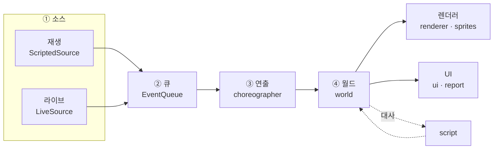
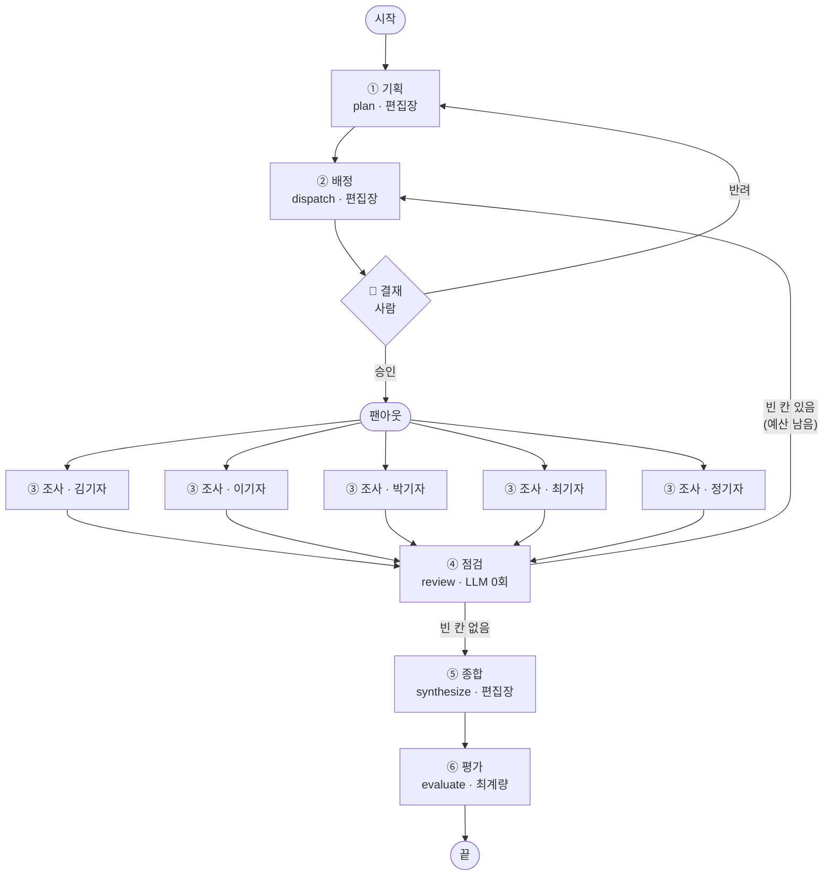
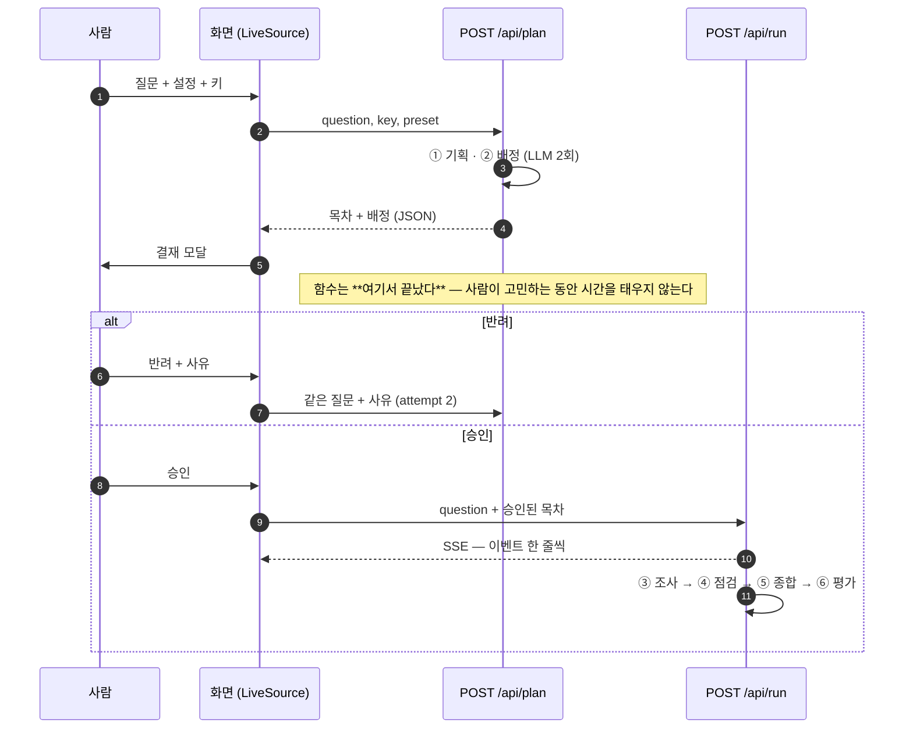
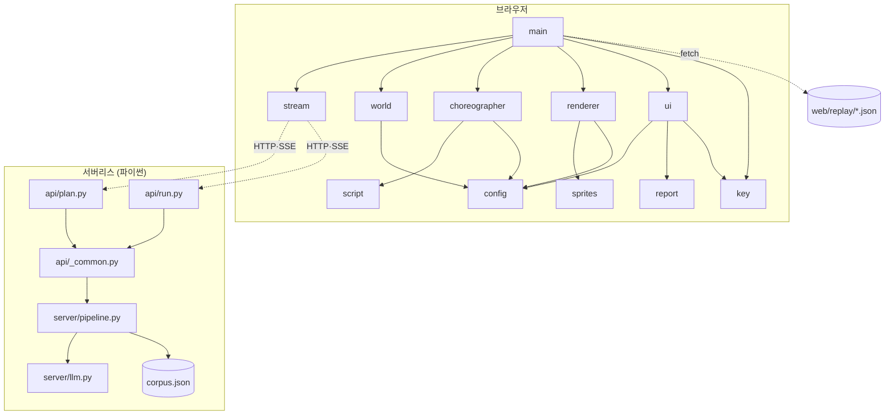
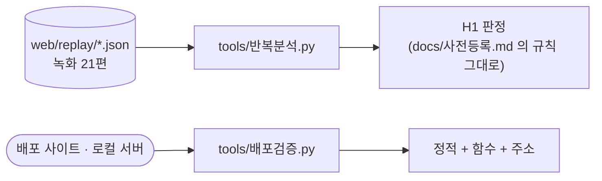

# 구조도

> 글로만 있던 것을 그림으로 옮긴 것이다. **새로운 설계가 아니다** — 각 그림 아래에
> 그 구조가 실제로 어디에 있는지 파일:줄로 적었다. 그림과 코드가 어긋나면 코드가 맞다.
>
> GitHub·VS Code 는 ```mermaid``` 를 그대로 그린다. 별도 도구가 필요 없다.

---

## 1. 4층 — 의미 이벤트 하나로 이어진다



층을 가르는 이유는 하나다 — **재생과 라이브가 아래 세 층을 똑같이 쓴다.**
녹화를 보든 실제로 돈을 쓰든 화면이 같은 코드로 움직여야, 발표에서 보여 준 것과
실제로 도는 것이 다르지 않다.

`web/js/main.js:36-51` 에서 네 층을 잇는다. 계약은 **의미 이벤트 13종뿐**이고,
그 목록은 `docs/설계도.md` 4장에 있다.

---

## 2. 파이프라인 6노드 — 결재 게이트가 끼어든다



- 🔏 **결재는 사람이 되돌릴 수 있는 유일한 지점**이다. 여기를 빼면 ①→⑥ 이 사람 없이 흐른다.
- ④ 점검은 **LLM 을 부르지 않는다.** 세고 되돌려 보낼 뿐이다 — 판정을 모델에 맡기면
  절제 실험의 숫자가 모델 기분을 타게 된다.
- ④ 가 빈 칸으로 보는 것은 두 가지다. ⓐ 기자가 스스로 '부족'이라 한 절,
  ⓑ **인용이 한 곳도 없는 절**(`설정["인용0곳점검"]`). ⓑ 는 나중에 넣었다 —
  제출 113건 중 13건(11.5%)이 '충분'이라 말하면서 근거를 0곳 달고 빠져나갔다.

`server/pipeline.py` — 그래프는 `build()`, 갈림길은 `fanout()` 과 `route()`.

---

## 3. 왜 두 번 부르나 — 서버리스 + 사람



서버리스 함수는 **사람을 기다리는 동안에도 실행 시간을 태운다.** Vercel Hobby 는
한 번에 60초다. 결재 게이트를 그 안에 두면 사람이 20초만 고민해도 예산의 3분의 1이 날아간다.
그래서 결재 **앞에서 한 번 끊는다.**

배정을 다시 돌리지 않는 것이 핵심이다 — 사람이 승인한 시작 문서가 바뀌면 결재가 헛것이 된다.
`api/run.py` 는 승인된 목차를 받아 `run_from()` 으로 **③ 부터** 잇는다.

---

## 4. 모듈 — 누가 누구를 부르나



- **파이프라인은 파이썬 하나뿐이다.** 한때 화면용 JS 파이프라인이 따로 있었는데
  (`web/js/pipeline.js`, 344줄) 지웠다. 두 벌이면 둘이 조용히 어긋나고,
  그때 화면이 보여 주는 것은 실제로 돈 것이 아니게 된다.
- `server/llm.py` 만 바깥(OpenAI)을 안다. 키는 요청 본문으로 들어와
  `llm.use_key()` 로 그 요청 동안만 쓰이고, 어디에도 적히지 않는다.
- `corpus.json` 은 손으로 고치지 않는다 — `build_corpus.py` 의 `SEEDS` 를 고쳐 다시 만든다.

---

## 5. 도구



- `tools/반복분석.py` — 녹화를 모아 세고, **사전등록한 판정 규칙을 코드로** 돌린다.
  반려된 실행(`rejected: true`)은 뺀다. 한 번 그걸 넣은 채 결론을 내서 q1-기본을
  61.8 대신 34.6으로 잘못 봤다.
- `tools/배포검증.py` — 정적 파일과 **서버리스 함수까지** 두드린다. 키 없이 401이
  오는 것이 정답이다. 빌드가 초록인데 함수만 죽어 있던 적이 있다.

---

## 6. 주소로 화면 부르기

발표에서 클릭을 줄이려고 만든 문이다. `web/js/main.js:14-34`.

| 파라미터 | 뜻 |
|---|---|
| `?replay=q4-역할끔` | 어느 녹화를 트나 (기본 `q1-기본`) |
| `?tab=live｜replay｜key` | 그 갈래를 펼친 채로 연다 (`settings` 는 `key` 의 별명) |
| `?speed=1｜2｜4` | 배속 |
| `?auto=0` | 멈춘 채로 연다 |
| `?report=1` | 결말로 건너뛰고 보고서를 편다 |

값이 이상하면 조용히 기본값으로 돌아간다. 주소 한 글자 때문에 빈 화면이 뜨는 것이 더 나쁘다.
